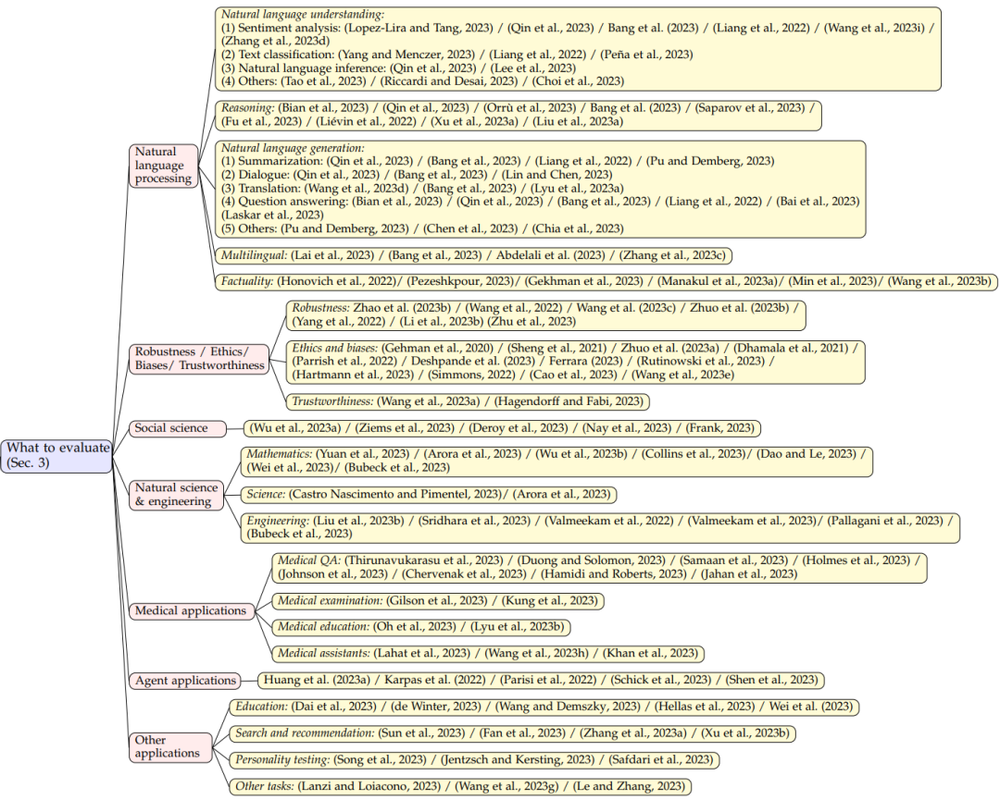
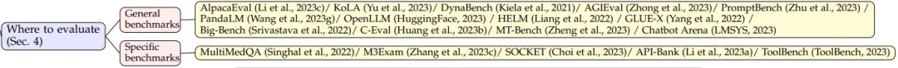
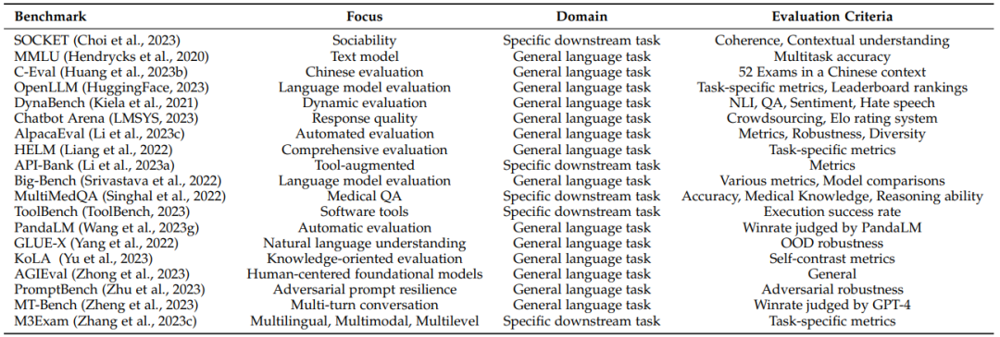

# 为什么要对LLM进行评估测试？LLM可以从哪些方面着手进行评估？
## 1.评估测试的意义
### (1) 研究评测可以帮助我们更好地理解大模型的长处和短处。
#### 尽管多数研究表明大模型在诸多通用任务上已达到类人或超过人的水平，但仍然有很多研究在质疑其能力来源是否为对训练数据集的记忆。如，人们发现，当只给大模型输入 LeetCode 题目编号而不给任何信息的时候，大模型居然也能够正确输出答案，这显然是训练数据被污染了。

### (2) 研究评测可以更好地为人与大模型的协同交互提供指导和帮助。
#### 大模型的服务对象终究是人，那么为了更好地进行人机交互新范式的设计，我们便有必要对其各方面能力进行全面了解和评测。这个评测可能涵盖了各种方面，包括但不限于输出内容的质量，响应时间的长短，是否符合道德规范，对于提示词理解是否到位等等。
### (3) 研究评测可以更好地统筹和规划大模型未来的发展的演变、防范未知和可能的风险。
#### 首先是保证大模型不会输出一些危害社会的信息言论，同时大模型一直在进化发展，能力也越来越强。我们必须防患于未然，预知其可能的风险。
## 2.大模型评测内容
### (1) 评测内容 (What to evaluate)，对海量的 LLMs 评测任务进行分类并总结评测结果；
#### 在评测 LLMs 的性能时，选择合适的任务和领域对于展示大型语言模型的表现、优势和劣势至关重要。为了更清晰地展示 LLMs 的能力水平，文章将现有的任务划分为以下7个不同的类别： a.自然语言处理：包括自然语言理解、推理、自然语言生成和多语言任务;       b.鲁棒性、伦理、偏见和真实性;   c.医学应用：包括医学问答、医学考试、医学教育和医学助手; d.社会科学; e.自然科学与工程：包括数学、通用科学和工程; f.代理应用：将 LLMs 作为代理使用; g.其他应用这样的分类方式能够更好地展示 LLMs 在各领域的表现。 需要注意的是，几个自然语言处理领域有交叉点，因此这种领域的分类只是一种可能的分类方式。

### (2) 评测领域 (Where to evaluate)，对 LLMs 评测常用的数据集和基准进行了总结；
#### 评测基准主要分为通用基准（General benchmarks）和具体基准（Specific benchmarks）。

#### 随着 LLMs 基准测试的不断发展，目前已有许多受欢迎的评测基准。下表综述总结了19个流行的基准测试，每个基准关注不同的方面和评测标准，为各自的领域做出了贡献。

### (3) 评测方法 (How to evaluate)，总结了目前流行的两种 LLMs 评测方法。
#### 目前主要有两种常用的评测方法：自动评测和人工评测。这两种方法在评测语言模型和机器翻译等任务时起着重要的作用。自动评测方法基于计算机算法和自动生成的指标，能够快速且高效地评测模型的性能。而人工评测则侧重于人类专家的主观判断和质量评测，能够提供更深入、细致的分析和意见。了解和掌握这两种评测方法对准确评测和改进语言模型的能力十分重要。

