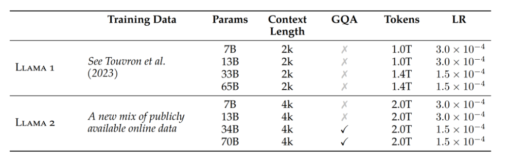
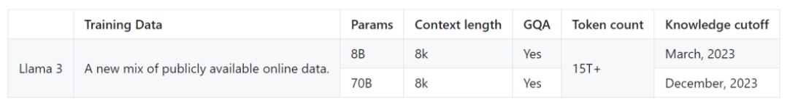
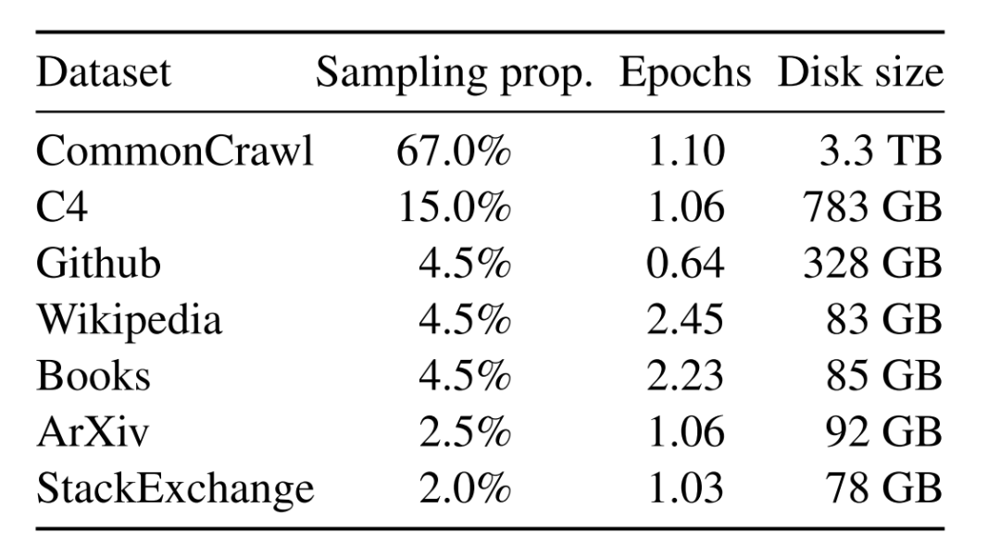
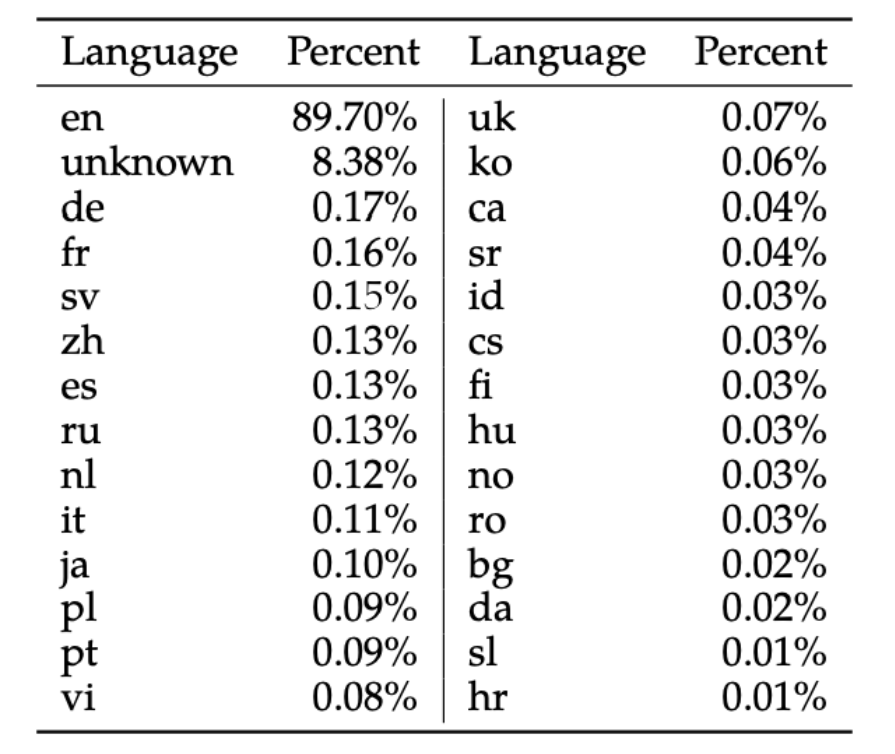
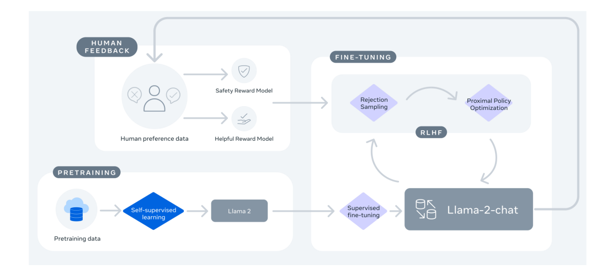
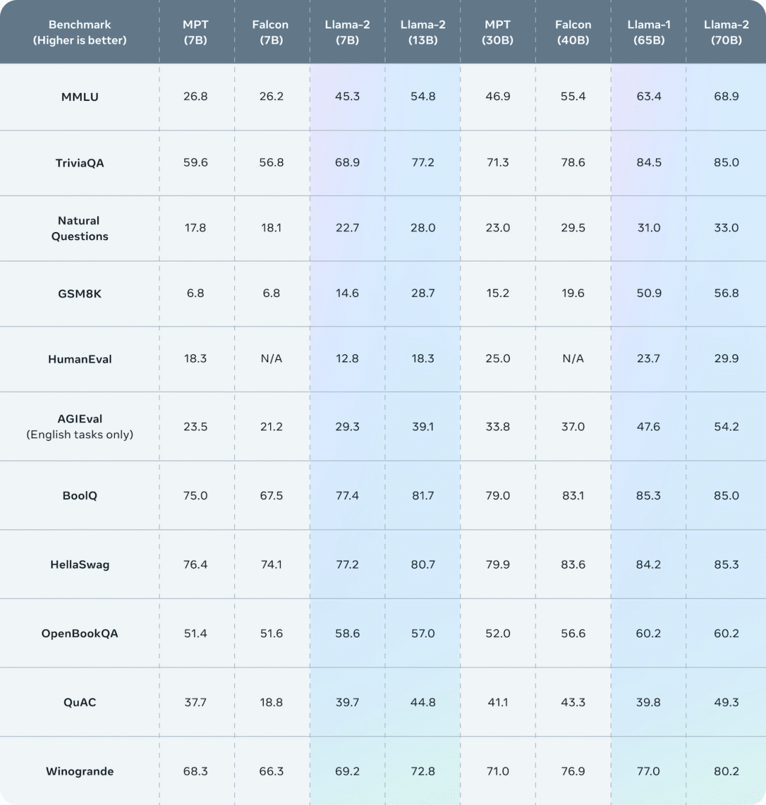
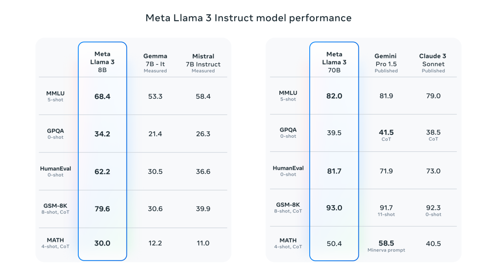

# Llama模型架构变化
## Llama模型与GPT类似，也是采用了基于解码器的架构。在原始Transformer解码器的基础上，Llama进行了如下改动：

### 为了增强训练稳定性，采用前置的RMSNorm作为层归一化方法。
### 为了提高模型性能，采用SwiGLU作为激活函数。
### 为了更好地建模长序列数据，采用RoPE作为位置编码。
### 为了平衡效率和性能，部分模型采用了分组查询注意力机制（Grouped-Query Attention, GQA）。
### 具体来说，首先将输入的token序列通过词嵌入（word embedding）矩阵转化为词向量序列。然后，词向量序列作为隐藏层状态依次通过𝐿个解码器层，并在最后使用RMSNorm进行归一化。归一化后的隐藏层状态将作为最后的输出。
### 在每个解码器层中，输入的隐藏层状态首先通过RMSNorm归一化然后被送入注意力模块。注意力模块的输出将和归一化前的隐藏层状态进行残差连接。之后，新的隐藏层状态进行RMSNorm归一化，然后被送入前馈网络层。类似地，前馈网络层的输出同样进行残差连接，作为解码器层的输出。
### 每个版本的Llama由于其隐藏层的大小、层数的不同，均有不同的变体。接下来，我们将展开看下每个版本的不同变体。

### Llama-2使用了和Llama-1相同的模型架构以及tokenizer。与Llama-1不同的是，Llama-2将上下文长长度扩展到了4k，并且34B和70B参数量版本使用了GQA。

### 与Llama 2相比，Llama-3将tokenizer由sentencepiece换成了tiktoken，这与GPT4 保持一致。同时，词表大小由32k扩展到了128k。另外，为了提高模型效率，Llama-3 8B和70B都采用了GQA。同时上下文长度也扩展到了8k。
    

# 训练数据
## Llama-1系列
### Llama-1使用了海量无标注数据进行自监督学习，这些预训练数据由多个来源混合而成，且都是公开的数据。各个来源的数据量和采样比例见下表。

### 英语CommonCrawl：Llama-1预处理了2017年至2020年间的五个CommonCrawl数据集。该过程在行级别去重，使用fastText线性分类器进行语言识别以去除非英语页面，并使用n-gram语言模型过滤低质量内容。此外，Llama-1训练了一个线性模型来分类维基百科中用作参考的页面和随机采样的页面，并丢弃了未被分类为参考的页面。
### C4：在探索性实验中，Llama-1观察到使用多样化的预处理CommonCrawl数据集可以提升性能。因此，Llama-1的数据中包括了公开可获得的C4数据集。C4的预处理也包括去重和语言识别步骤：与CCNet的主要区别在于质量过滤，主要依赖于标点符号的存在或网页中的单词和句子数量等启发式规则。
### Github：Llama-1使用Google BigQuery上可公开获取的GitHub数据集。Llama-1仅保留在Apache、BSD和MIT许可下分发的项目。此外，Llama-1还使用基于行长度或字母数字字符比例的启发式规则过滤低质量文件，并用正则表达式移除如页眉等样板内容。最后，Llama-1在文件级别对结果数据集进行去重，匹配精确相同的内容。
### 维基百科：Llama-1添加了2022年6月至8月期间的维基百科数据，涵盖使用拉丁或西里尔文字的20种语言。Llama-1处理数据以移除超链接、评论和其他格式化的样板内容。
### Gutenberg和Books3：Llama-1在训练数据集中包括了两个书籍语料库：Gutenberg项目（包含公共领域的书籍）和ThePile的Books3部分，一个公开可获得的用于训练大型语言模型的数据集。Llama-1在书籍级别进行去重，移除超过90%内容重合的书籍。
### ArXiv ：Llama-1处理ArXiv的Latex文件，以增加科学数据到Llama-1的数据集。Llama-1移除了第一节之前的所有内容以及参考文献部分。Llama-1还移除了.tex文件中的注释，并内联扩展了用户编写的定义和宏，以增强论文间的一致性。
### Stack Exchange：Llama-1包括了Stack Exchange的数据转储，这是一个涵盖从计算机科学到化学等多种领域的高质量问题和答案的网站。Llama-1保留了28个最大网站的数据，移除了文本中的HTML标签，并根据得分将答案排序（从最高到最低）。
### 经过上述处理，Llama-1的整个训练数据集包含大约1.4T token。对于Llama-1的大部分训练数据，每个token在训练期间只使用一次，但维基百科和Books的数据进行了大约两个epoch的训练。
  

## Llama-2
### Llama-2 预训练使用了来自公开可用源的 2T个数据token（未详细指出具体的开源数据）。
### Llama 2的预训练主要集中在英语数据上，尽管实验观察表明模型在其他语言方面已有一定的熟练度，但由于非英语语言的预训练数据量有限，其熟练度受到限制（如下图所示）。

### 预训练数据截至到2022年9月，但某些调整数据较新，直到2023年7月。
  

## Llama-3
### LLAMA-3其训练数据量大幅增加，从LLAMA-2的2T Tokens扩展到了15T Tokens，增长了约8倍。其中，代码数据扩充了4倍，显著提升了模型在代码能力和逻辑推理能力方面的表现。

### LLAMA-3提供了三种规模的模型版本：小型模型具有8B参数，其性能略优于Mistral 7B和Gemma 7B；中型模型则拥有70B参数，其性能介于ChatGPT 3.5和GPT 4之间；大型模型规模达到400B，目前仍在训练中，旨在成为一个多模态、多语言版本的模型，预期性能应与GPT 4或GPT 4V相当。

### 值得注意的是，LLAMA-3并没有采用MOE（Mixture of Experts）结构，这种结构主要用于降低训练和推理成本，但在性能上通常无法与同规模的密集型（Dense）模型相比。随着模型规模的扩大，如何降低推理成本将成为一个需要关注的问题。

### 此外，LLAMA-3的训练数据包括了大量的代码token和超过5%的非英语token，来源于30多种语言。这不仅使得模型在处理英语内容时更加高效，也显著提升了其多语言处理能力，这表明LLAMA-3在全球多语言环境中的适应性和应用潜力。

### 为确保数据质量，Meta开发了一系列数据过滤pipeline，包括启发式过滤器、NSFW过滤器、语义重复数据删除技术及用于预测数据质量的文本分类器。这些工具的有效性得益于先前版本Llama的表现，特别是在识别高质量数据方面。

### 此外，Meta通过大量实验评估了在最终预训练数据集中混合不同来源数据的最佳策略，确保Llama-3能在多种场景下展现卓越性能，如日常琐事、STEM 领域、编程和历史知识等。

# 训练方法
## Llama-1
### Llama-1模型是一个基础的自监督学习模型，它没有经过任何形式的特定任务微调。自监督学习是一种机器学习技术，其中模型通过分析大量未标记的数据来预测其输入数据的某些部分。这种方法允许模型在没有人类标注的数据的情况下自动学习数据的内在结构和复杂性。Llama-1在公布的技术报告中详细描述了使用AdamW优化器的机器学习模型的具体训练配置。AdamW是对Adam优化器的改进，可以更有效地处理权重衰减，从而提高训练的稳定性。β1和β2参数的选择影响训练过程的收敛行为和稳定性。Llama-1描述的余弦学习率调度是一种有效的技术，用于在训练期间调整学习率，通过逐渐减少学习率，在某些情况下可以导致更好的收敛。实施0.1的权重衰减和1.0的梯度裁剪是预防过拟合和确保数值稳定性的标准做法。使用预热步骤是一种策略性方法，旨在训练过程初期稳定训练动态。根据模型大小调整学习率和批量大小是一种优化资源分配和效率的实用方法，有可能提高模型性能。
## Llama-2
### Llama-2模型是在Llama-1的基础上进一步发展的，而Llama-2-Chat模型则是基于Llama-2进行微调的版本。这两个模型保持了固定的4k上下文长度，这与OpenAI的GPT-4在微调过程中可能增加的上下文长度不同。

### 在Llama-2和Llama-2-Chat的微调中，采用了自回归损失函数，这是一种在生成模型中常见的方法，模型预测下一个token时会考虑到之前的所有token。在训练过程中，用户输入提示的token损失被清零，这意味着模型被训练以忽略这些特定的token，从而更专注于生成回复。

### Llama-2-Chat的训练过程如下图所示。整个过程起始于利用公开数据对Llama-2进行预训练。在此之后，通过有监督微调创建了Llama-2-Chat的初始版本。随后，使用基于人类反馈的强化学习（RLHF）方法来迭代地改进模型，具体包括拒绝采样（Rejection Sampling）和近端策略优化（Proximal Policy Optimization, PPO）。在RLHF阶段，人类偏好数据也在并行迭代，以保持奖励模型的更新。

## Llama-3
### 与Llama-2类似，Llama-3系列也有两个模型——预训练模型Llama-3和微调后的模型Llama-3-Instruct。

### 在预训练阶段，为了有效地利用预训练数据，Llama-3投入了大量精力来扩大预训练。具体而言，通过为下游基准测试制定一系列扩展法则（scaling laws），使得在训练之前就能预测出模型在关键任务上的性能，进而选择最佳的数据组合。

### 在这一过程中，Llama-3对扩展法则有了一些新的观察。例如，根据DeepMind 团队提出的Chinchilla扩展法则，8B模型的最优训练数据量约为200B token，但实验发现，即使训练了两个数量级的数据后，模型性能仍在继续提高。在多达15T token上进行训练后，8B和70B参数的模型都继续以对数线性的方式提升性能。

### 为了训练最大的Llama-3模型，Meta结合了三种并行策略：数据并行、模型并行和流水并行。当同时在16K GPU上进行训练时，最高效的策略实现了每个GPU超过400TFLOPS的计算利用率。最后，模型在两个定制的24K GPU集群上进行了训练。

### 为了最大限度地延长GPU的正常运行时间，Meta开发了一个先进的新训练堆栈，可以自动检测、处理和维护错误。另外还大大提高了硬件可靠性和无声数据损坏的检测机制，并开发了新的可扩展存储系统，减少了检查点和回滚的开销。这些改进使总的有效训练时间超过95%。综合起来，这些改进使Llama-3的训练效率比Llama-2提高了约三倍。

### 在微调阶段，Meta对模型的微调方法进行了重大创新，结合了有监督微调（Supervised Fine-Tuning, SFT）、拒绝采样、近似策略优化（Proximal Policy Optimization, PPO）和直接策略优化（Direct Policy Optimization, DPO）。这种综合方法优化了模型在执行复杂的推理和编码任务时的表现。特别是通过偏好排序的训练，Llama-3在处理复杂的逻辑推理问题时能更准确地选择最合适的答案，这对于提高AI在实际应用中的可用性和可靠性至关重要。

# 效果对比
## Llama2 vs Llama1

## Llama3 vs Llama2
