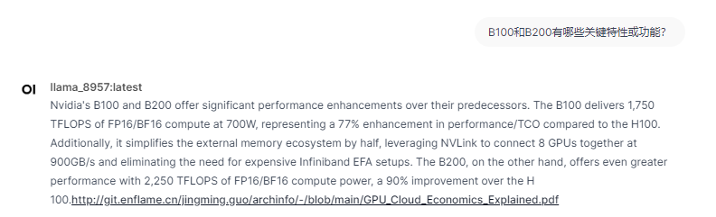
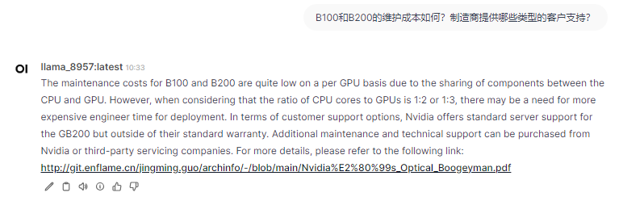
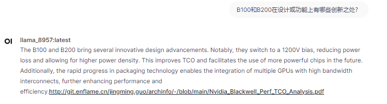

# 对应数据集中的问题

## 内容和数据集中的内容有重合，但对于涉及范围较大的问题可能会结合多个文档输出但只输出1个链接  
# 关于B100和B200的设问

## Nvidia 的 B100 和 B200 的性能显著优于其前代产品。B100 以 700W 的功率提供 1,750 TFLOPS 的 FP16/BF16 计算能力，与 H100 相比，性能/TCO 提高了 77%。此外，它将外部内存生态系统简化了一半，利用 NVLink 以 900GB/s 的速度将 8 个 GPU 连接在一起，无需昂贵的 Infiniband EFA 设置。另一方面，B200 的性能更高，FP16/BF16 计算能力达到 2,250 TFLOPS，比 H 100 提高了 90%。http://git.enflame.cn/jingming.guo/archinfo/-/blob/main/GPU_Cloud_Economics_Explained.pdf

## B100 和 B200 采用台积电的 5nm 工艺技术，在计算块、内存带宽和 NVLink 范围方面具有相似的配置。它们的主要区别在于功耗和硅银比，B100 的设计适合现有服务器，无需重新设计基板。在性能方面，B200 的 FLOPS 比 B100 高 30%，得益于 NVLink、跨州内存和 SRAM 的低成本。有关更多详细信息，请参阅以下链接：http://git.enflame.cn/jingming.guo/archinfo/-/blob/main/Nvidia_Blackwell_Perf_TCO_Analysis.pdf

## B100 旨在用于数据中心部署，预计将用于 AI 应用。它比其前代产品有了显著的进步，性能和效率都有所提高。另一方面，B200 专为超级计算和极端 AI 工作负载而设计，需要至少 2,000 TFLOPS 的 FP16/BF16 计算能力。它与 enflame-ml 库及其各种分发格式同义，使其成为大规模 AI 训练和推理任务的理想选择。http://git.enflame.cn/jingming.guo/archinfo/-/blob/main/Nvidia_Blackwell_Perf_TCO_Analysis.pdf

## 尽管 B100 带来了诸多改进，但市场对 B100 的反应相当冷淡。Nvidia 的竞争对手，包括 Google、Meta 和 Microsoft，已经获得了他们想要的供应，这使得 Nvidia 对 B100 并没有太大的兴趣。这种冷淡可能会持续一段时间，因为 Nvidia 目前没有理由将标准提高得更高。B200 的功耗和成本更高，在部署复杂性和成本效益方面提出了进一步的挑战。http://git.enflame.cn/jingming.guo/archinfo/-/blob/main/Nvidia_Blackwell_Perf_TCO_Analysis.pdf

## B100 的 GPU 主板售价为 19999 美元，而 B200 的售价为 24999 美元。与前几代产品相比，Nvidia 的价格大幅下降。但是，考虑到之前售价约为 35000 美元且性能明显不如 H100 的 L40S SXM，B100 的定价似乎更具竞争力。与 H100 相比，B100 的性能/TCO 提高了 77%，解决了行业高通胀的担忧。在性价比方面，B100 在内存带宽方面优于 AMD 的 MI300X，但在 FLOPS 方面却有所不足，这对那些寻求以实惠价格获得高性能计算的人来说是一个具有挑战性的难题。http://git.enflame.cn/jingming.guo/archinfo/-/blob/main/GPU_Cloud_Economics_Explained.pdf

## 不，Nvidia 选择不为 B100 和 B200 提供升级和扩展选项。这一决定意味着客户在使用这些 GPU 时将只能使用主机系统上现有的 CPU 和内存量。如果需求增长超出主机系统所能处理的范围，缺乏可扩展性可能会导致需要新的服务器。http://git.enflame.cn/jingming.guo/archinfo/-/blob/main/Nvidia_Blackwell_Perf_TCO_Analysis.pdf

## B100、B200 及其网络选项与现有系统的兼容性值得注意。这些 GPU 旨在用于 GB200 NVL72 和 NVL36 系统，以及 BG000 NVL576 和 NVL264 集群。除非将整个服务器替换为 GB200 机箱，否则它们不适合集成到较旧的 HGX H100 或 H200 系统中。互连是例外，它允许混合和匹配计算块以优化容量。有关更多详细信息，请参阅以下链接：http://git.enflame.cn/jingming.guo/archinfo/-/blob/main/Nvidia%E2%80%99s_Optical_Boogeyman.pdf

## 由于 CPU 和 GPU 之间共享组件，B100 和 B200 的每 GPU 维护成本相当低。但是，考虑到 CPU 核心与 GPU 的比例为 1:2 或 1:3，可能需要更昂贵的工程师时间来进行部署。在客户支持选项方面，Nvidia 为 GB200 提供标准服务器支持，但不在其标准保修范围内。可以从 Nvidia 或第三方服务公司购买额外的维护和技术支持。有关更多详细信息，请参阅以下链接：http://git.enflame.cn/jingming.guo/archinfo/-/blob/main/Nvidia%E2%80%99s_Optical_Boogeyman.pdf

## B100 和 B200 的市场定位针对需要极致性能并愿意为此支付高价的高端客户。这些客户看重速度、效率和功率，并不关心功耗或每瓦成本。B100 和 B200 的定价反映了这种高端市场定位，这些产品被视为投资，而不是以成本为中心的购买。http://git.enflame.cn/jingming.guo/archinfo/-/blob/main/Nvidia_Blackwell_Perf_TCO_Analysis.pdf

## B100 和 B200 带来了多项创新设计改进。值得注意的是，它们切换到 1200V 偏置，从而降低了功率损耗并实现了更高的功率密度。这改善了 TCO 并有助于未来使用更强大的芯片。此外，封装技术的快速进步使得能够集成具有高带宽互连的多个 GPU，从而进一步提高性能和效率。http://git.enflame.cn/jingming.guo/archinfo/-/blob/main/Nvidia_Blackwell_Perf_TCO_Analysis.pdf

## Nvidia 的新款 GPU（包括 B100 和 B200）的生产引发了人们对其环境影响的担忧。与前几代 GPU 相比，生产过程中使用的水量是其 5 倍，产生的二氧化碳排放量是其 3 倍。这引发了人们对 Nvidia 制造方法的可持续性及其产品的整体环境足迹的质疑。http://git.enflame.cn/jingming.guo/archinfo/-/blob/main/Nvidia%E2%80%99s_Optical_Boogeyman.pdf

## B100 和 B200 在安全性能方面各有考量和特点。其中一个值得注意的方面是 CPU 和用于张量并行的第三方 ASIC 之间的 NVLink 网络的比较。文中讨论了使用不同类型并行所涉及的权衡，强调了平衡 CPU 和 GPU 网络的通信延迟和带宽的挑战。此外，文中指出，虽然 B100 和 B200 都对张量并行有硬件支持，但 CPU 和 GPU 并行之间的选择对于优化安全性和性能仍然很重要。http://git.enflame.cn/jingming.guo/archinfo/-/blob/main/GB200_Hardware_Architecture.pdf

## 文中没有提及 B100 和 B200 未来的具体计划或潜在更新。它侧重于将 Nvidia 的产品与英特尔和 AMD 等竞争对手的产品进行比较，并强调他们在与 Nvidia 的路线图竞争时面临的挑战。这表明 Nvidia 可能有内部路线图决策，但文中没有明确讨论。http://git.enflame.cn/jingming.guo/archinfo/-/blob/main/GB200_Hardware_Architecture.pdf