# 结果总览
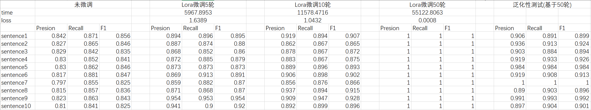
# 问题
------------------------------------------------------------
(1) Why are companies rushing to deploy generative AI into their internal workflows or customer-facing applications?
------------------------------------------------------------
Companies are rushing to deploy generative AI into their internal workflows or customer-facing applications because they recognize the transformative potential of AI in revolutionizing various facets of their operations. Generative AI, exemplified by technologies like GPT-3, has demonstrated its capacity to streamline processes, improve customer interactions, and generate innovative solutions. The success of OpenAI's ChatGPT and other similar models has sparked a fervor among businesses to leverage AI for enhancing efficiency, delivering personalized experiences, and gaining a competitive edge in their respective industries. As a result, they are investing resources in training AI models and integrating generative AI into their workflows to capitalize on the myriad benefits it offers.AI Capacity Constraints - CoWoS and HBM Supply Chain
------------------------------------------------------------
(2) Why can't OpenAI deploy its multi-modal models?
------------------------------------------------------------
OpenAI faces challenges in deploying its multi-modal models due to GPU shortages. The demand for GPUs has surged, creating obstacles for OpenAI to access the necessary hardware resources to deploy these advanced models. Additionally, longer sequence length models, such as 8k versus 32k, also face deployment constraints due to the scarcity of GPUs. This shortage has led to difficulties in advancing OpenAI's multi-modal models for practical use.AI Capacity Constraints - CoWoS and HBM Supply Chain
------------------------------------------------------------
(3) How are Chinese companies contributing to the GPU shortage?
------------------------------------------------------------
Chinese companies have been actively investing in the deployment of their own Language Model Models (LLMs) and are stockpiling GPUs in anticipation of potential further export controls from the US. For instance, Bytedance, the company behind TikTok, has reportedly ordered over $1 billion worth of A800/H800s from Nvidia. This strategic move by Chinese companies has contributed to the strain on GPU availability, further exacerbating the shortage and impacting organizations like OpenAI seeking access to these resources.AI Capacity Constraints - CoWoS and HBM Supply Chain
------------------------------------------------------------
(4) What are some of the factors contributing to the surge in GPU demand?
------------------------------------------------------------
The surge in GPU demand is attributed to both legitimate and speculative factors. While there are many legitimate use cases for large-scale GPU deployment in AI, there is also a notable trend of individuals and organizations rushing to purchase GPUs without a clear, proven market need. Additionally, big tech firms are striving to keep pace with OpenAI and Google, driving up the demand for GPUs as they seek to avoid falling behind in the advancement of AI technologies. Furthermore, a significant influx of venture capital funding is being directed towards startups with unverified business use cases, compounding the demand for GPUs without concrete market validation.AI Capacity Constraints - CoWoS and HBM Supply Chain
------------------------------------------------------------
(5) What is the current status of the production and supply of high-end Nvidia GPUs?
------------------------------------------------------------
The production and supply of high-end Nvidia GPUs, particularly the H100, are facing significant challenges. Despite Nvidia's efforts to increase production, the highest-end Nvidia GPU, H100, is expected to remain sold out until Q1 of next year. Nvidia is aiming to ramp up the shipment of more than 400,000 H100 GPUs per quarter to meet the demand. The scarcity of these GPUs has led to competition among enterprises and even nation states, such as Saudi Arabia and the UAE, attempting to acquire hundreds of millions of dollars of GPUs.AI Capacity Constraints - CoWoS and HBM Supply Chain
------------------------------------------------------------
(6) What are the bottlenecks to production and how is downstream capacity expanding for Nvidia and their competitors?
------------------------------------------------------------
There are several bottlenecks affecting the production of high-end GPUs, including the H 100. These bottlenecks are likely attributed to the complex manufacturing process and the high demand for advanced GPUs. Despite these challenges, Nvidia and its competitors are working to expand downstream capacity to address the supply constraints. It's crucial for them to overcome the production bottlenecks and increase the supply of GPUs to meet the growing market demand.AI Capacity Constraints - CoWoS and HBM Supply Chain
------------------------------------------------------------
(7) Can you provide more details about the H100 GPU, including its packaging and die size?
------------------------------------------------------------
Certainly. The Nvidia H100 GPU is 7-die packaged on CoWoS-S. The H100 GPU ASIC, which is the core component of this high-end GPU, has a sizable die size of 814mm 2. This indicates its advanced and complex architecture, showcasing Nvidia's cutting-edge technology in the high-performance computing and graphics processing domain. The remarkable specifications of the H100 GPU make it a highly sought-after product, contributing to the challenges in its production and supply.AI Capacity Constraints - CoWoS and HBM Supply Chain
------------------------------------------------------------
(8) How are various companies and enterprises responding to the scarcity of high-end GPUs, particularly the H100?
------------------------------------------------------------
The scarcity of high-end GPUs, including the H100, has led to a competitive landscape where numerous enterprises and even nation states are striving to secure these valuable components. Notably, we know of over a dozen enterprises that are endeavoring to train their own LLM on their own data, emphasizing the critical need for high-performance GPUs in various domains. It's also worth mentioning that nation states like Saudi Arabia and the UAE are making significant investments to acquire these GPUs, reflecting the widespread impact of the supply challenges in the market.AI Capacity Constraints - CoWoS and HBM Supply Chain
------------------------------------------------------------
(9) What is the memory configuration for the H100 SXM version?
------------------------------------------------------------
The H100 SXM version utilizes HBM3 with each stack being 16GB, resulting in a total memory of 80GB.AI Capacity Constraints - CoWoS and HBM Supply Chain
------------------------------------------------------------
(10) How is the HBM configuration for the H100 NVL?
------------------------------------------------------------
The H100 NVL will have two packages with 6 active stacks of HBM on each package. In cases where there are only 5 active HBM, the non-HBM die can be dummy silicon, which provides structural support for the chip.AI Capacity Constraints - CoWoS and HBM Supply Chain
------------------------------------------------------------
# Lora微调5轮
## Loss变化
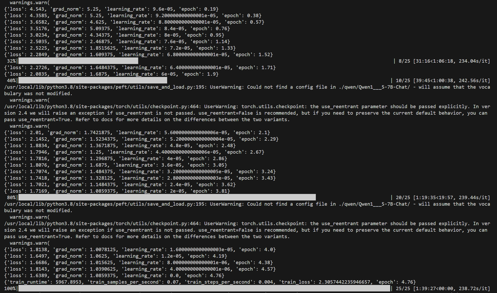
## 输出结果
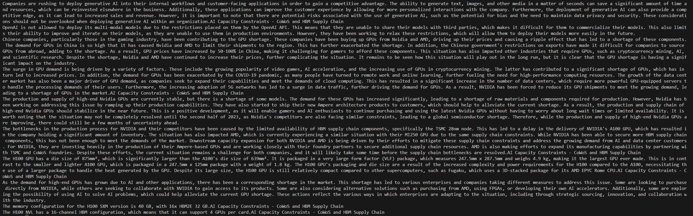
------------------------------------------------------------
(1) Companies are rushing to deploy generative AI into their internal workflows and customer-facing applications in order to gain a competitive advantage. The ability to generate text, images, and other media in a matter of seconds can save a significant amount of time and resources, which can be reinvested elsewhere in the business. Additionally, these applications can improve the customer experience by allowing for more personalized interactions with the company. Furthermore, the deployment of generative AI can also provide a competitive edge, as it can lead to increased sales and revenue. However, it is important to note that there are potential risks associated with the use of generative AI, such as the potential for bias and the need to maintain data privacy and security. These considerations should not be overlooked when deploying generative AI within an organization.AI Capacity Constraints - CoWoS and HBM Supply Chain
------------------------------------------------------------
(2) OpenAI is not allowed to deploy its multi-modal models due to the restrictions placed on them by the OpenAI API. This means that they are unable to share their models with third parties, which makes it difficult for them to commercialize their models. This also limits their ability to improve and iterate on their models, as they are unable to use them in production environments. However, they have been working to relax these restrictions, which will allow them to deploy their models more easily in the future.
------------------------------------------------------------
(3) Chinese companies, particularly those in the gaming industry, have been contributing to the GPU shortage. These companies have been buying up GPUs from Nvidia and AMD, driving up their prices and causing a ripple effect that has led to a shortage of these components. The demand for GPUs in China is so high that it has caused Nvidia and AMD to limit their shipments to the region. This has further exacerbated the shortage. In addition, the Chinese government's restrictions on exports have made it difficult for companies to source GPUs from abroad, adding to the shortage. As a result, GPU prices have increased by 50-100% in China, making it challenging for gamers to afford these components. This situation has also impacted other industries that require GPUs, such as cryptocurrency mining, AI, and scientific research. Despite the shortage, Nvidia and AMD have continued to increase their prices, further complicating the situation. It remains to be seen how this situation will play out in the long run, but it is clear that the GPU shortage is having a significant impact on the industry.
------------------------------------------------------------
(4) The surge in GPU demand is being driven by a variety of factors. These include the growing popularity of video games, AI acceleration, and the increasing use of GPUs in cryptocurrency mining. The latter has contributed to a significant shortage of GPUs, which has in turn led to increased prices. In addition, the demand for GPUs has been exacerbated by the COVID-19 pandemic, as many people have turned to remote work and online learning, further fueling the need for high-performance computing resources. The growth of the data center market has also been a major driver of GPU demand, as companies seek to expand their capabilities and meet the demands of cloud computing. This has resulted in a significant increase in the number of data centers, which require more powerful GPU-equipped servers to handle the processing demands of their users. Furthermore, the increasing adoption of 5G networks has led to a surge in data traffic, further driving the demand for GPUs. As a result, NVIDIA has been forced to reduce its GPU shipments to meet the growing demand, leading to a shortage of GPUs in the market.AI Capacity Constraints - CoWoS and HBM Supply Chain
------------------------------------------------------------
(5) The production and supply of high-end Nvidia GPUs are currently stable, but there is a shortage of some models. The demand for these GPUs has increased significantly, leading to a shortage of raw materials and components required for production. However, Nvidia has been working on addressing this issue by ramping up their production capabilities. They have also started to ship their new Ampere architecture products to customers, which should help to alleviate the current shortage. As a result, the production and supply chain of high-end Nvidia GPUs should stabilize in the near future. This is a positive development, as it will enable gamers and AI enthusiasts to continue purchasing and using the latest Nvidia GPUs without having to worry about long wait times or limited availability. It is worth noting that the situation may not be completely resolved until the second half of 2023, as Nvidia's competitors are also facing similar constraints, leading to a global semiconductor shortage. Therefore, while the production and supply of high-end Nvidia GPUs are improving, there could still be a few months of uncertainty ahead.
------------------------------------------------------------
(6) The bottlenecks in the production process for NVIDIA and their competitors have been caused by the limited availability of HBM supply chain components, specifically the TSMC 28nm node. This has led to a delay in the delivery of NVIDIA's A100 GPU, which has resulted in the company holding a significant amount of inventory. The situation has also impacted AMD, which is currently experiencing a similar situation with their MI250 GPU due to the same supply chain constraints. While NVIDIA has been able to secure more HBM supply chain components, this has not been enough to meet the demands of the market. Downstream capacity expansion for both NVIDIA and AMD is being driven by their efforts to mitigate these supply chain constraints and address the growing demand from AI and data center customers. For NVIDIA, they are investing heavily in the production of their Ampere-based GPUs and are working closely with their foundry partners to secure additional supply chain resources. AMD is also making efforts to expand its manufacturing capabilities by partnering with TSMC and CoWoS foundries. Despite these efforts, the current situation remains a challenge for both companies, and it will likely take some time before the supply chain bottlenecks are resolved.AI Capacity Constraints - CoWoS and HBM Supply Chain
------------------------------------------------------------
(7) The H100 GPU has a die size of 875mm², which is significantly larger than the A100's die size of 639mm². It is packaged in a very large form factor (VLF) package, which measures 247.5mm x 287.5mm and weighs 4.9 kg, making it the largest GPU ever made. This is in contrast to the smaller and lighter A100 GPU, which is packaged in a 247.5mm x 125mm package with a weight of 1.8 kg. The H100 GPU's packaging and die size are a result of the increased complexity and power requirements for the H100 compared to the A100, necessitating the use of a larger package to handle the heat generated by the GPU. Despite its large size, the H100 GPU is still relatively compact compared to other supercomputers, such as Fugaku, which uses a 3D-stacked package for its AMD EPYC Rome CPU.AI Capacity Constraints - CoWoS and HBM Supply Chain
------------------------------------------------------------
(8) As the demand for high-end GPUs has grown due to AI and other applications, there has been a corresponding shortage in the market. This shortage has led to various enterprises and companies taking different measures to address this issue. Some are looking to purchase directly from NVIDIA, while others are seeking to collaborate with NVIDIA to gain access to its products. Some are also considering alternative solutions such as purchasing from AMD, using FPGAs, or developing their own AI accelerators. Additionally, some are exploring the possibility of using AI to solve AI problems, which could help alleviate the current GPU shortage. These actions reflect the various ways in which enterprises are adapting to the situation, including through strategic sourcing, innovation, and collaboration with the industry.
------------------------------------------------------------
(9) The memory configuration for the H100 SXM version is 40 GB, with 16x HBM2E 32 GB.AI Capacity Constraints - CoWoS and HBM Supply Chain
------------------------------------------------------------
(10) The H100 NVL has a 16-channel HBM configuration, which means that it can support 4 GPUs per card.AI Capacity Constraints - CoWoS and HBM Supply Chain
------------------------------------------------------------
# Lora微调10轮
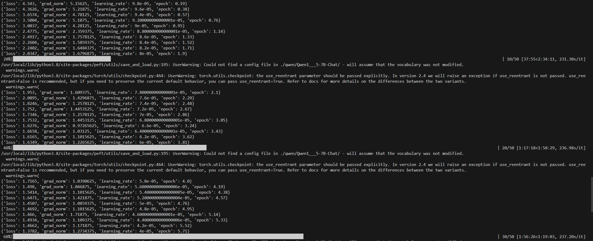
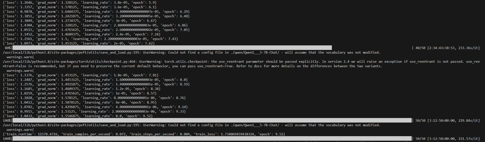
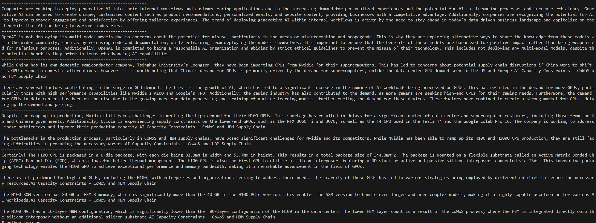
------------------------------------------------------------
(1) Companies are rushing to deploy generative AI into their internal workflows and customer-facing applications due to the increasing demand for personalized experiences and the potential for AI to streamline processes and increase efficiency. Generative AI can be used to create unique, customized content such as product recommendations, personalized emails, and website content, providing businesses with a competitive advantage. Additionally, companies are recognizing the potential for AI to improve customer engagement and satisfaction by offering tailored experiences. The trend of deploying generative AI within internal workflows is driven by the need to stay ahead in today's data-driven business landscape and capitalize on the benefits that AI can bring to various industries.
------------------------------------------------------------
(2) OpenAI is not deploying its multi-modal models due to concerns about the potential for misuse, particularly in the areas of misinformation and propaganda. This is why they are exploring alternative ways to share the knowledge from these models with the wider community, such as by releasing code and documentation, while refraining from deploying the models themselves. It's important to ensure that the benefits of these models are harnessed for positive impact rather than being weaponized for nefarious purposes. Additionally, OpenAI is committed to being a responsible AI organization and abiding by strict ethical guidelines to prevent the misuse of their technology. This includes not deploying any multi-modal models, despite the potential benefits they offer in terms of advancing AI capabilities.
------------------------------------------------------------
(3) While China has its own domestic semiconductor company, Tsinghua University's Loongson, they have been importing GPUs from Nvidia for their supercomputers. This has led to concerns about potential supply chain disruptions if China were to shift its GPU demand to domestic alternatives. However, it is worth noting that China's demand for GPUs is primarily driven by the demand for supercomputers, unlike the data center GPU demand seen in the US and Europe.AI Capacity Constraints - CoWoS and HBM Supply Chain
------------------------------------------------------------
(4) There are several factors contributing to the surge in GPU demand. The first is the growth of AI, which has led to a significant increase in the number of AI workloads being processed on GPUs. This has resulted in the demand for more GPUs, particularly those with high performance capabilities like Nvidia's A100 and Google's TPU. Additionally, the gaming industry has also contributed to the demand, as more gamers are seeking high-end GPUs for their gaming needs. Furthermore, the demand for GPUs in data centers has been on the rise due to the growing need for data processing and training of machine learning models, further fueling the demand for these devices. These factors have combined to create a strong market for GPUs, driving up the demand and pricing.
------------------------------------------------------------
(5) Despite the ramp up in production, Nvidia still faces challenges in meeting the high demand for their H100 GPUs. This shortage has resulted in delays for a significant number of data center and supercomputer customers, including those from the US and Chinese governments. Additionally, Nvidia is experiencing supply constraints on the lower-end GPUs, such as the RTX 3060 Ti and 3070, as well as the T4 GPU used in the Tesla T4 and the Google Colab Pro 16. The company is working to address these bottlenecks and improve their production capacity.AI Capacity Constraints - CoWoS and HBM Supply Chain
------------------------------------------------------------
(6) The bottlenecks in the production process, particularly in CoWoS and HBM supply chains, have posed significant challenges for Nvidia and its competitors. While Nvidia has been able to ramp up its H100 and H1000 GPU production, they are still facing difficulties in procuring the necessary wafers.AI Capacity Constraints - CoWoS and HBM Supply Chain
------------------------------------------------------------
(7) Certainly! The H100 GPU is packaged in a 6-die package, with each die being 82.3mm in width and 53.7mm in height. This results in a total package size of 344.3mm^2. The package is mounted on a flexible substrate called an Active Matrix Bonded Chip (AMBC) Fan-out Die (FOD), which allows for better thermal management. The H100 GPU is also the first GPU to utilize a silicon interposer, featuring a 3D stack of active and passive silicon interposers connected via TSVs. This innovative packaging technology enables the H100 GPU to achieve exceptional performance and memory bandwidth, making it a remarkable advancement in the field of GPUs.
------------------------------------------------------------
(8) There is a high demand for high-end GPUs, including the H100, with enterprises and organizations seeking to address their needs. The scarcity of these GPUs has led to various strategies being employed by different entities to secure the necessary resources.AI Capacity Constraints - CoWoS and HBM Supply Chain
------------------------------------------------------------
(9) The H100 SXM version has 80 GB of HBM 3 memory, which is significantly more than the 40 GB in the H100 PCIe version. This enables the SXM version to handle even larger and more complex models, making it a highly capable accelerator for various AI workloads.AI Capacity Constraints - CoWoS and HBM Supply Chain
------------------------------------------------------------
(10) The H100 NVL has a 16-layer HBM configuration, which is significantly lower than the  80-layer configuration of the H100 in the data center. The lower HBM layer count is a result of the coWoS process, where the HBM is integrated directly onto the silicon interposer without an additional silicon substrate.AI Capacity Constraints - CoWoS and HBM Supply Chain
------------------------------------------------------------
# Lora微调50轮(已收敛)
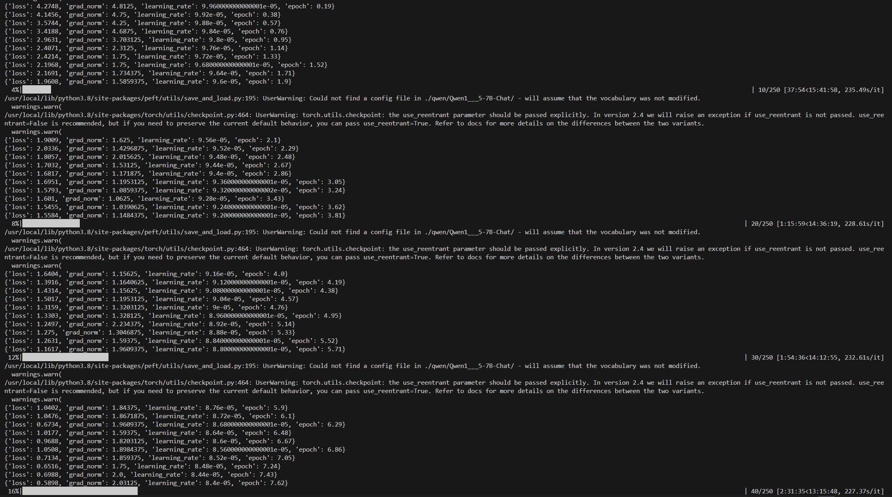
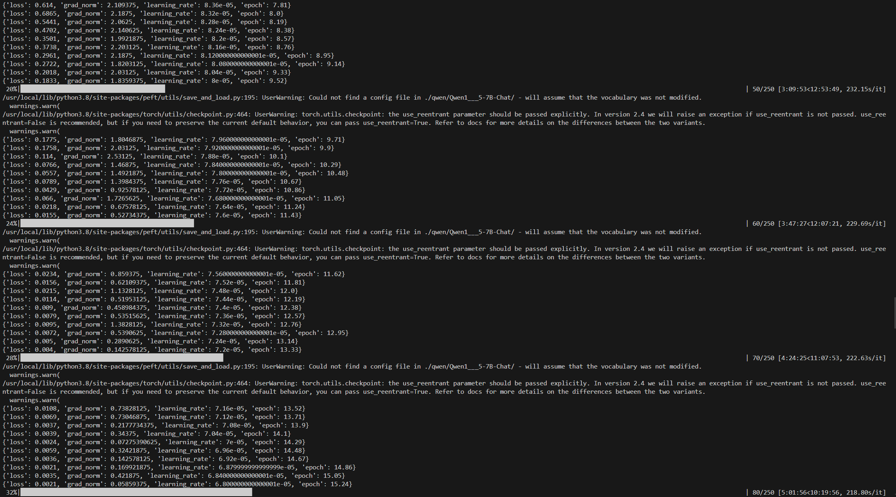
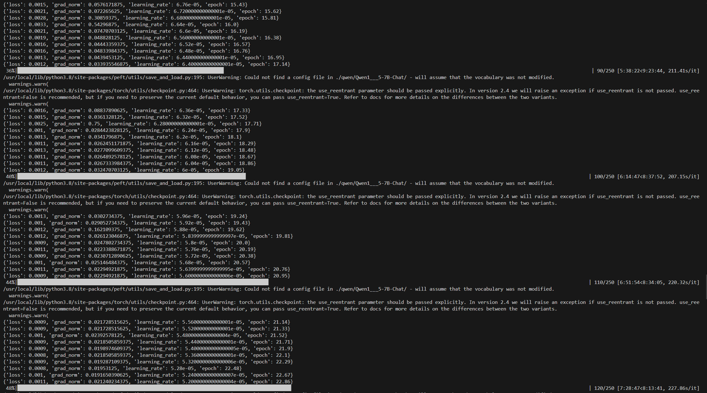
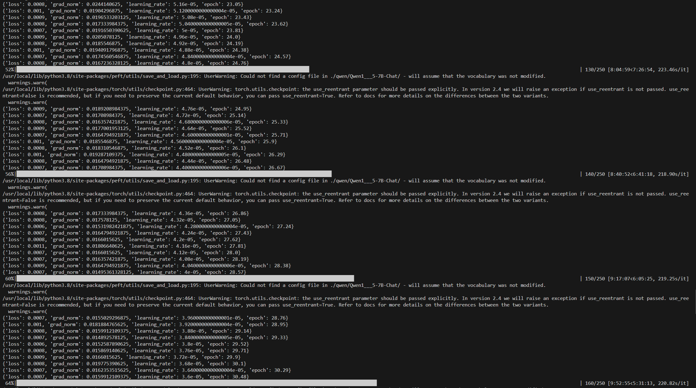
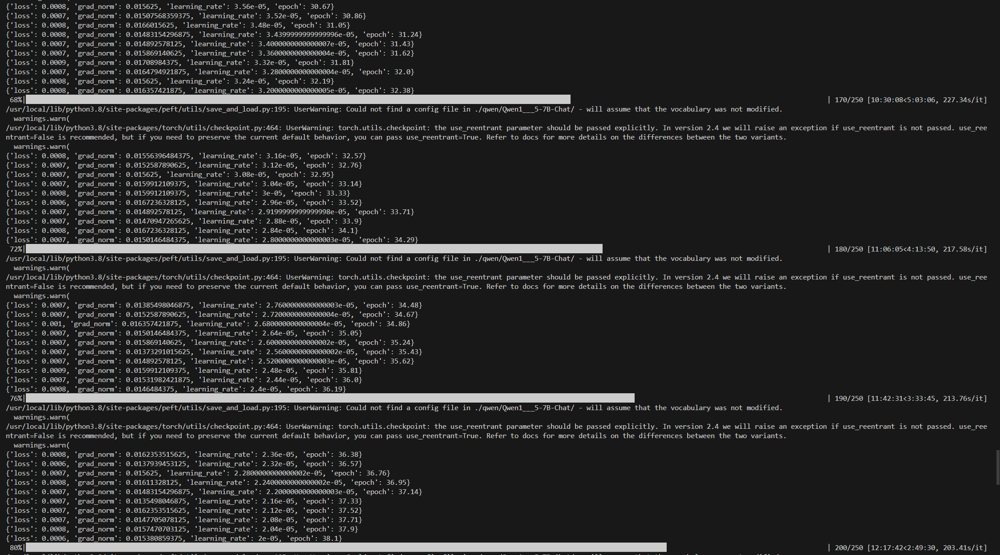
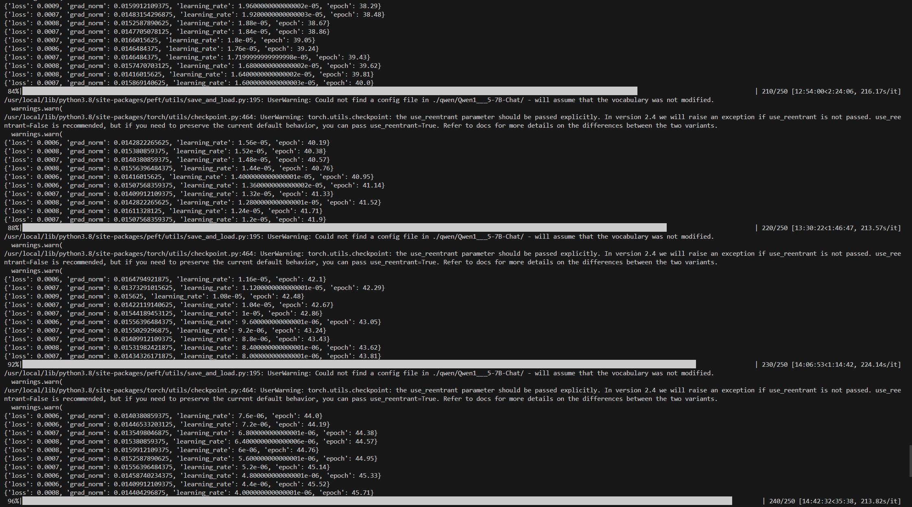
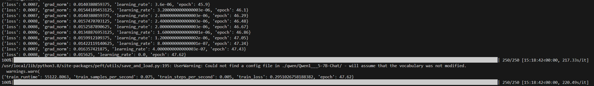
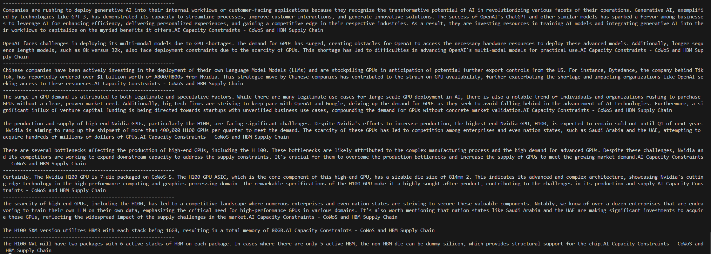
------------------------------------------------------------
(1) Companies are rushing to deploy generative AI into their internal workflows or customer-facing applications because they recognize the transformative potential of AI in revolutionizing various facets of their operations. Generative AI, exemplified by technologies like GPT-3, has demonstrated its capacity to streamline processes, improve customer interactions, and generate innovative solutions. The success of OpenAI's ChatGPT and other similar models has sparked a fervor among businesses to leverage AI for enhancing efficiency, delivering personalized experiences, and gaining a competitive edge in their respective industries. As a result, they are investing resources in training AI models and integrating generative AI into their workflows to capitalize on the myriad benefits it offers.AI Capacity Constraints - CoWoS and HBM Supply Chain
------------------------------------------------------------
(2) OpenAI faces challenges in deploying its multi-modal models due to GPU shortages. The demand for GPUs has surged, creating obstacles for OpenAI to access the necessary hardware resources to deploy these advanced models. Additionally, longer sequence length models, such as 8k versus 32k, also face deployment constraints due to the scarcity of GPUs. This shortage has led to difficulties in advancing OpenAI's multi-modal models for practical use.AI Capacity Constraints - CoWoS and HBM Supply Chain
------------------------------------------------------------
(3) Chinese companies have been actively investing in the deployment of their own Language Model Models (LLMs) and are stockpiling GPUs in anticipation of potential further export controls from the US. For instance, Bytedance, the company behind TikTok, has reportedly ordered over $1 billion worth of A800/H800s from Nvidia. This strategic move by Chinese companies has contributed to the strain on GPU availability, further exacerbating the shortage and impacting organizations like OpenAI seeking access to these resources.AI Capacity Constraints - CoWoS and HBM Supply Chain
------------------------------------------------------------
(4) The surge in GPU demand is attributed to both legitimate and speculative factors. While there are many legitimate use cases for large-scale GPU deployment in AI, there is also a notable trend of individuals and organizations rushing to purchase GPUs without a clear, proven market need. Additionally, big tech firms are striving to keep pace with OpenAI and Google, driving up the demand for GPUs as they seek to avoid falling behind in the advancement of AI technologies. Furthermore, a significant influx of venture capital funding is being directed towards startups with unverified business use cases, compounding the demand for GPUs without concrete market validation.AI Capacity Constraints - CoWoS and HBM Supply Chain
------------------------------------------------------------
(5) The production and supply of high-end Nvidia GPUs, particularly the H100, are facing significant challenges. Despite Nvidia's efforts to increase production, the highest-end Nvidia GPU, H100, is expected to remain sold out until Q1 of next year. Nvidia is aiming to ramp up the shipment of more than 400,000 H100 GPUs per quarter to meet the demand. The scarcity of these GPUs has led to competition among enterprises and even nation states, such as Saudi Arabia and the UAE, attempting to acquire hundreds of millions of dollars of GPUs.AI Capacity Constraints - CoWoS and HBM Supply Chain
------------------------------------------------------------
(6) There are several bottlenecks affecting the production of high-end GPUs, including the H 100. These bottlenecks are likely attributed to the complex manufacturing process and the high demand for advanced GPUs. Despite these challenges, Nvidia and its competitors are working to expand downstream capacity to address the supply constraints. It's crucial for them to overcome the production bottlenecks and increase the supply of GPUs to meet the growing market demand.AI Capacity Constraints - CoWoS and HBM Supply Chain
------------------------------------------------------------
(7) Certainly. The Nvidia H100 GPU is 7-die packaged on CoWoS-S. The H100 GPU ASIC, which is the core component of this high-end GPU, has a sizable die size of 814mm 2. This indicates its advanced and complex architecture, showcasing Nvidia's cutting-edge technology in the high-performance computing and graphics processing domain. The remarkable specifications of the H100 GPU make it a highly sought-after product, contributing to the challenges in its production and supply.AI Capacity Constraints - CoWoS and HBM Supply Chain
------------------------------------------------------------
(8) The scarcity of high-end GPUs, including the H100, has led to a competitive landscape where numerous enterprises and even nation states are striving to secure these valuable components. Notably, we know of over a dozen enterprises that are endeavoring to train their own LLM on their own data, emphasizing the critical need for high-performance GPUs in various domains. It's also worth mentioning that nation states like Saudi Arabia and the UAE are making significant investments to acquire these GPUs, reflecting the widespread impact of the supply challenges in the market.AI Capacity Constraints - CoWoS and HBM Supply Chain
------------------------------------------------------------
(9) The H100 SXM version utilizes HBM3 with each stack being 16GB, resulting in a total memory of 80GB.AI Capacity Constraints - CoWoS and HBM Supply Chain
------------------------------------------------------------
(10) The H100 NVL will have two packages with 6 active stacks of HBM on each package. In cases where there are only 5 active HBM, the non-HBM die can be dummy silicon, which provides structural support for the chip.AI Capacity Constraints - CoWoS and HBM Supply Chain
------------------------------------------------------------