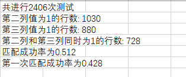

[toc]

# 1 数据集的选择

## (1) 数据集转化流程梳理

以下主要演示一种将杂乱无章的问答形式的数据内容转化为大模型训练所需json格式的转化过程
原始内容

    import re

    def format_text(input_file_path, output_file_path):
        with open(input_file_path, 'r', encoding='utf-8') as file:
            content = file.read()

    questions = re.split('问[：:]\s*', content)[1:]

    formatted_text = ''
        for q in questions:
            if re.search('答[：:]\s*', q):
                parts = re.split('答[：:]\s*', q, 1)
                question, answer = parts[0], parts[1]
                formatted_question = '问：' + question.strip()
                # 移除答案文本中的所有换行符
                formatted_answer = '答：' + answer.replace('\n', ' ').strip()
                # 保留数字列表格式，但不引入新的换行符
                formatted_answer = re.sub(r'(\d+)\.', r' \1.', formatted_answer)
                formatted_text += f'{formatted_question}\n{formatted_answer}\n\n'
            else:
                formatted_text += '问：' + q.strip() + '\n\n'

    with open(output_file_path, 'w', encoding='utf-8') as file:
            file.write(formatted_text)

    # 指定源文件路径和输出文件路径
    source_file_path = 'C:\\software\\代码\\test.txt'
    output_file_path = 'text.txt'

    # 调用函数
    format_text(source_file_path, output_file_path)

内容的格式化梳理

    import json

    # 定义文件路径
    file_path = 'text.txt'
    output_file_path = 'train.json'

    def convert_file_to_llm_format(file_path):
        llm_data = []
        with open(file_path, 'r', encoding='utf-8') as file:
            lines = file.readlines()
            for i in range(len(lines) - 1):  # 遍历到倒数第二行，避免索引越界
                if lines[i].startswith('问：') and lines[i+1].startswith('答：'):
                    instruction = lines[i].split('问：', 1)[1].strip()
                    output = lines[i+1].split('答：', 1)[1].strip()
                    llm_data.append({
                        "instruction": instruction,
                        "input": "",
                        "output": output
                    })
        return llm_data

    def save_llm_data_to_file(llm_data, output_file_path):
        with open(output_file_path, 'w', encoding='utf-8') as file:
            json.dump(llm_data, file, ensure_ascii=False, indent=4)

    llm_formatted_data = convert_file_to_llm_format(file_path)
    save_llm_data_to_file(llm_formatted_data, output_file_path)

    print(f'数据已成功保存到文件：{output_file_path}')
转换为需要的json格式
这是我们首先考虑到的问题，即如何将我们想要的问答形式的数据集梳理成训练可用的json/jsonl格式。解决完这个问题之后我们需要考虑下一个问题，如何提取PDF中的有效内容构建适合我们的数据集。

## (2) 数据集的构建流程

### a.单链接数据集的构建流程

由于PDF源文件全部为英文，同时内容较为复杂，人工处理的难度太大同时无法保证质量，故我们选择通过LLM来对PDF中的内容进行初步提炼并通过(1).中所述方法对其进行格式转换。

#### I. LLM选择

首先我们分别尝试通过qwen1.5-7b，llama3-8b，gpt3.5-turbo进行数据集的提取，由于qwen1.5-7b提取出来的内容会产生较多幻觉，llama3-8b提取出的问答对较短，经过比较我们最终选择gpt3.5-turbo进行内容提取；

#### II. 数据集提取逻辑梳理

我们首先将PDF按照.进行划分，即10句话作为一个整体，让GPT对内容精炼处理，同时根据处理后的内容作问，即我们数据集的雏形，代码如下所示;
    def process_text(input_file_path, output_file_path, sentences_per_paragraph=10):
        # 读取文件内容并移除换行符
        with open(input_file_path, 'r', encoding='utf-8') as file:
            content = file.read().replace('\n', '')
            content = content.replace('Machine Translated by Google', '')

    # 初始化变量
        paragraph = []
        sentence_count = 0
        paragraphs = []

    # 分割文本为句子并分组成段落
        for sentence in content.split('. '):
            if sentence:  # 忽略空句子
                paragraph.append(sentence + '. ')
                sentence_count += 1
                if sentence_count >= sentences_per_paragraph:
                    paragraphs.append('《question》\n' + ''.join(paragraph))
                    paragraph = []  # 重置段落
                    sentence_count = 0

    # 添加最后一个段落（如果有）
        if paragraph:
            paragraphs.append('《question》\n' + ''.join(paragraph))

    # 写入处理后的文本到新文件
        with open(output_file_path, 'w', encoding='utf-8') as file:
            for paragraph in paragraphs:
                file.write(paragraph + '\n\n')

    print('文件处理中.....')

    # 定义文件路径
    input_file_path = 'C:\software\代码\数据集创造\数据集.txt'
    # output_file_path = '数据集梳理.txt'
    # 按句号分段
    sentences_per_paragraph_values = 10
    output_file_path = f'数据集梳理.txt'
    # 调用函数
        process_text(input_file_path, output_file_path, sp)

    # -*- coding:utf-8 -*-
    import openai

    # 你的OpenAI API密钥
    api_key = "sk-rMjaIuSFP9DAtZRmEeDaC04d3c2e4bEbB87eE5022a7eB8Bb"
    openai.api_base = "https://api.xty.app/v1"

    def chat_with_gpt3_5(user_input, max_retries=3):
        system_message = {
            "role": "system",
            "content": "把其中关键的内容提取出来，制作成我需要的对话数据集的格式，也就是常见的问答数据语料，请不要用第三视角制作数据集。请你用第一或者第二视角例如：问:你觉得为什么我总是倒霉？答:我觉得你太消极了，你可以多关注一些别的好的一方面。不要总关心坏的一方面。仿照我给的例子用问: 答: 这样的格式制作数据集。最后，问答对中，在答的部分，要给出足够长的回答。下面是原文："
        }
        user_message = {"role": "user", "content": user_input}

    for attempt in range(1, max_retries + 1):
            try:
                response = openai.ChatCompletion.create(
                    model="gpt-3.5-turbo",
                    messages=[system_message, user_message],
                    api_key=api_key
                )
                assistant_reply = response['choices'][0]['message']['content']
                return assistant_reply
            except Exception as e:
                print(f"处理问题时出错，尝试次数：{attempt}/{max_retries}。错误信息：{e}")
                if attempt == max_retries:
                    return f"重试{max_retries}次后仍然失败，错误信息：{e}"

    def batch_chat_with_gpt3_5_immediate_print_and_save(question_list, output_file):
        with open(output_file, 'w', encoding='utf-8') as file:
            for question in question_list:
                # 获取每个问题的回答
                answer = chat_with_gpt3_5(question)
                # 立即打印每个问题的回答
                print(f"Assistant: {answer}\n")
                # 将回答写入文件，不包含任何前缀
                file.write(f"{answer}\n\n")

    def load_questions_from_file(file_path):
        questions = []
        with open(file_path, 'r', encoding='utf-8') as file:
            content = file.read()
            questions = content.split("《问题》")[1:]  # 分割文本以获取问题列表
            questions = [q.strip() for q in questions]  # 去除每个问题前后的空格
        return questions

    # 假设的文件路径，请替换为您的实际文件路径
    file_path = "数据集梳理.txt"
    # 输出文件的名称
    output_file = "内容回复.txt"

    # 从文件加载问题
    questions = load_questions_from_file(file_path)

    # 使用加载的问题与模型进行交云，并保存回复到文件
    batch_chat_with_gpt3_5_immediate_print_and_save(questions, output_file)

> [第一版数据集](./m第一版数据集.jsonl)

#### III. 逻辑优化

我们根据II.所述方法创建数据集发现对于PDF内容的提炼较少同时有一些连贯信息被分割，故选择通过多重划分的方式重塑数据集，即以10，15，20，30，50句分别作为整体，让GPT提炼内容并制作数据集;

> [第二版数据集](./第二版数据集.jsonl)

#### IV. 中文数据集的转化

我们通过III.进一步对数据集进行加工处理，但我们意识到中文的数据集能更好的应对我们的大模型所对应的工作场景同时也更有利于我们对数据集中的内容进行进一步的分析，故我们通过如下处理将我们的数据集转换为中文;

> [第三版数据集](./第三版数据集.jsonl)

#### V. 数据清洗

我们根据IV.所述方法创建数据集发现对于PDF内容的提炼较为充足但存在数据集问题和回答内容相似的问题，这些相似的问答既增加了训练的时长同时也影响了微调的精度(由于数据集长度的增加)，同时我们希望回答能对应到相应的PDF所在链接，
故我们对数据集进行了相似度的筛选(基于TF-IDF)，并为数据集的output添加了对应的文档链接，代码如下所示:
    import json
    import jieba
    from sklearn.feature_extraction.text import TfidfVectorizer
    from sklearn.metrics.pairwise import cosine_similarity

    # 读取JSONL文件并解析每一行
    def read_jsonl(file_path):
        with open(file_path, 'r', encoding='utf-8') as file:
            for line in file:
                yield json.loads(line)

    # 加载JSONL数据并进行中文分词
    def load_data(jsonl_file):
        data = read_jsonl(jsonl_file)
        segmented_data = []
        for item in data:
            # 确保item['input']是字符串类型
            if isinstance(item['input'], bytes):
                item['input'] = item['input'].decode('utf-8')
            # 使用jieba进行中文分词
            segmented_input = ' '.join(jieba.cut(item['input']))
            segmented_data.append({'input': segmented_input, 'output': item['output']})
        return segmented_data

    # 计算输入之间的相似度并过滤数据
    def calculate_similarity_and_filter(data, threshold):
        inputs = [item['input'] for item in data]
        vectorizer = TfidfVectorizer()
        tfidf_matrix = vectorizer.fit_transform(inputs)
        similarity_matrix = cosine_similarity(tfidf_matrix)

    to_delete = []
        for i in range(len(similarity_matrix)):
            for j in range(i + 1, len(similarity_matrix)):
                if similarity_matrix[i, j] > threshold:
                    # 比较输出长度，删除较短的输出对应的输入
                    if len(data[i]['output']) < len(data[j]['output']):
                        to_delete.append(i)
                    else:
                        to_delete.append(j)
        to_delete = set(to_delete)
        filtered_data = [data[i] for i in range(len(data)) if i not in to_delete]
        return filtered_data

    # 将数据写入JSONL文件，使用writelines方法
    def write_jsonl(data, output_file):
        with open(output_file, 'w', encoding='utf-8') as file:
            new_lines = [json.dumps(item, ensure_ascii=False) + '\n' for item in data]
            file.writelines(new_lines)

    # 主函数
    def main(jsonl_file, threshold, output_file):
        data = load_data(jsonl_file)
        filtered_data = calculate_similarity_and_filter(data, threshold)
        write_jsonl(filtered_data, output_file)
        print(f"Filtered data has been written to {output_file}")

    # 运行主函数
    if__name__ == "__main__":
        threshold = 0.7 # 设置相似度阈值
        input_jsonl_file = 'train.jsonl'  # 指定输入JSONL文件的路径
        output_jsonl_file = 'filter7_data.jsonl'  # 指定输出JSONL文件的名称
        main(input_jsonl_file, threshold, output_jsonl_file)

> [第四版数据集](./第四版数据集.jsonl)

#### VI. 数据筛选

我们通过V.进一步对数据集进行加工处理，具体的操作内容如下：

  1.将jsonl格式的数据集文件转存为docx格式(Google translate支持的文档形式)
  2.利用Google translate将数据集文件转换为中文形式
  3.清除中文数据集中存在转换错误的部分
  4.通过关键词检索中文数据集中不合理的设问(例如：请重述这个问题)
  5.通过对应的英文关键词筛除对应的英文设问
  6.筛除数据集中的有关承接上文的问句(例如：上一个input为"什么是HBM？",下一个input为"它的技术结构是怎么样的？")
  7.筛除output较短的回答(通过tokens以及中文字符的个数)

经此处理，我们得到了语义质量相对较高的中文数据集。

> [第五版数据集](./第五版数据集.jsonl)

#### VII. 数据集再过滤

我们发现除e.所述的数据集内容问题外，数据集中仍存在一些无用内容，于是我们通过关键字筛除一些关于国家，非知识性，通识等类型的内容，进一步简化我们的数据集，最终形成了我们现在的数据集。

> [第六版数据集](./第六版数据集.jsonl)

### b.多链接数据集的构建流程

经历上述单链接数据集的构建流程，我们得到了一份只有单链接的微调数据集。如果我们选择通过PDF中的相似内容来制作多链接数据集难度巨大，所以可以考虑通过对单链接的数据集进行合并来创建我们多链接数据集的demo。

#### I. 多链接数据集构建逻辑

首先我们应该梳理合并的逻辑以保证数据集合并之后输入输出既能够对应又不完全重合，以达到多链接的目的。于是我们设定了一下规则:

    1.只比较input(即问题)的相似度，因为很明显，如果对应同一问题在不同文档中有着不一样的看法亦或者是不同侧重是我们想要看到的多链接输出的效果，即对一个问题更全面的认识；
    2.对于output当中链接相同的问题不进行合并，因为我们希望得到的是对问题多角度的反馈，而同一链接所反馈的内容大多重叠或一致，也并没有达到多链接的效果;
    3.对于input或者output完全相同的内容不进行合并，因为此时的input或output是出于数据集扩容的需要所作，其链接一致，无需合并。

因此，我们的代码如下所示:
    import json
    import jieba
    from sklearn.feature_extraction.text import TfidfVectorizer
    from sklearn.metrics.pairwise import cosine_similarity

    # 读取JSONL文件并解析每一行
    def read_jsonl(file_path):
        with open(file_path, 'r', encoding='utf-8') as file:
            for line_number, line in enumerate(file, 1):
                try:
                    yield json.loads(line)
                except json.JSONDecodeError:
                    print(f"Skipping invalid JSON at line {line_number}: {line.strip()}")

    # 加载JSONL数据并进行中文分词
    def load_data(jsonl_file):
        data = read_jsonl(jsonl_file)
        segmented_data = []
        for item in data:
            # 确保item['input']是字符串类型
            if isinstance(item['input'], bytes):
                item['input'] = item['input'].decode('utf-8')
            # 使用jieba进行中文分词
            segmented_input = ' '.join(jieba.cut(item['input']))
            segmented_data.append({'input': segmented_input, 'output': item['output']})
        return segmented_data

    # 计算输入之间的相似度并合并数据
    def calculate_similarity_and_merge(data, threshold):
        inputs = [item['input'] for item in data]
        vectorizer = TfidfVectorizer()
        tfidf_matrix = vectorizer.fit_transform(inputs)
        similarity_matrix = cosine_similarity(tfidf_matrix)

    merged_data = []
        used_indices = set()

    for i in range(len(data)):
            if i in used_indices:
                continue
            for j in range(i + 1, len(data)):
                if j in used_indices:
                    continue
                # Check if inputs are the same or outputs start with 'http' and are the same
                if data[i]['input'] == data[j]['input'] or (data[i]['output'].split('http')[-1] == data[j]['output'].split('http')[-1]) or data[i]['output'] == data[j]['output']:
                    continue
                if similarity_matrix[i, j] > threshold:
                    merged_input = data[i]['input'] + " " + data[j]['input']
                    merged_output = data[i]['output'] + " " + data[j]['output']
                    merged_data.append({'input': merged_input.strip(), 'output': merged_output.strip()})
                    used_indices.update([i, j])
                    break  # Break to avoid multiple merges
            else:
                # If no merge was performed, skip this item
                continue

    return merged_data

    # 将数据写入JSONL文件，使用writelines方法
    def write_jsonl(data, output_file):
        with open(output_file, 'w', encoding='utf-8') as file:
            new_lines = [json.dumps(item, ensure_ascii=False) + '\n' for item in data]
            file.writelines(new_lines)

    # 主函数
    def main(jsonl_file, threshold, output_file):
        data = load_data(jsonl_file)
        merged_data = calculate_similarity_and_merge(data, threshold)
        if merged_data:  # Only write if there is merged data
            write_jsonl(merged_data, output_file)
            print(f"Merged data has been written to {output_file}")
        else:
            print("No data to merge. No file written.")

    # 运行主函数
    if__name__ == "__main__":
        threshold = 0.7 # 设置相似度阈值
        input_jsonl_file = 'new__test.jsonl'  # 指定输入JSONL文件的路径
        output_jsonl_file = 'merged_data.jsonl'  # 指定输出JSONL文件的名称
        main(input_jsonl_file, threshold, output_jsonl_file)

我们所建立的数据集如下所示

> [多链接数据集](./merged_data.jsonl)

#### II. 逻辑微调与数据集合并

调整的逻辑如下:

    1.使用一个变量longest_input来跟踪当前合并组中最长的输入，使其作为多链接数据集中整合答案的input;
    2.添加了一个辅助函数should_merge来检查两个输出是否不应该合并（即它们相同或者链接部分相同）;
    3.合并单链接数据集和多链接数据集的过程中优先保留多链接数据集，并筛除重复度高的单链接数据集。

因此我们的代码如下所示：

    import json
    import jieba
    from sklearn.feature_extraction.text import TfidfVectorizer
    from sklearn.metrics.pairwise import cosine_similarity

    # 读取JSONL文件并解析每一行
    def read_jsonl(file_path):
        with open(file_path, 'r', encoding='utf-8') as file:
            for line_number, line in enumerate(file, 1):
                try:
                    yield json.loads(line)
                except json.JSONDecodeError:
                    print(f"Skipping invalid JSON at line {line_number}: {line.strip()}")

    # 加载JSONL数据并进行中文分词
    def load_data(jsonl_file):
        data = read_jsonl(jsonl_file)
        segmented_data = []
        for item in data:
            # 确保item['input']是字符串类型
            if isinstance(item['input'], bytes):
                item['input'] = item['input'].decode('utf-8')
            # 使用jieba进行中文分词
            segmented_input = ' '.join(jieba.cut(item['input']))
            segmented_data.append({'input': segmented_input, 'output': item['output']})
        return segmented_data

    # 计算输入之间的相似度并合并数据
    def calculate_similarity_and_merge(data, threshold):
        inputs = [item['input'] for item in data]
        vectorizer = TfidfVectorizer()
        tfidf_matrix = vectorizer.fit_transform(inputs)
        similarity_matrix = cosine_similarity(tfidf_matrix)

    merged_data = []
        used_indices = set()

    for i in range(len(data)):
            if i in used_indices:
                continue
            longest_input = data[i]['input']
            merged_outputs = set([data[i]['output']])
            current_indices = [i]

    for j in range(i + 1, len(data)):
                if j in used_indices:
                    continue
                if should_merge(data[i]['output'], data[j]['output']):
                    if similarity_matrix[i, j] > threshold:
                        if len(data[j]['input']) > len(longest_input):
                            longest_input = data[j]['input']
                        merged_outputs.add(data[j]['output'])
                        current_indices.append(j)
                        used_indices.add(j)

    if len(current_indices) > 1:  # Only add if more than one item was merged
                merged_data.append({'input': longest_input.strip(), 'output': '\n'.join(merged_outputs)})
            used_indices.update(current_indices)  # Mark all indices in the current group as used

    return merged_data

    def should_merge(output1, output2):
        # Check if outputs are the same or have the same link part
        if output1 == output2:
            return False
        if output1.split('http')[-1] == output2.split('http')[-1]:
            return False
        return True

    # 将数据写入JSONL文件，使用writelines方法
    def write_jsonl(data, output_file):
        with open(output_file, 'w', encoding='utf-8') as file:
            new_lines = [json.dumps(item, ensure_ascii=False) + '\n' for item in data]
            file.writelines(new_lines)

    # 主函数
    def main(jsonl_file, threshold, output_file):
        data = load_data(jsonl_file)
        merged_data = calculate_similarity_and_merge(data, threshold)
        if merged_data:  # Only write if there is merged data
            write_jsonl(merged_data, output_file)
            print(f"Merged data has been written to {output_file}")
        else:
            print("No data to merge. No file written.")

    # 运行主函数
    if__name__ == "__main__":
        threshold = 0.75 # 设置相似度阈值
        input_jsonl_file = '第三版数据集.jsonl'  # 指定输入JSONL文件的路径
        output_jsonl_file = 'merged_data.jsonl'  # 指定输出JSONL文件的名称
        main(input_jsonl_file, threshold, output_jsonl_file)

    import json
    import jieba
    from sklearn.feature_extraction.text import TfidfVectorizer
    from sklearn.metrics.pairwise import cosine_similarity

    # 读取JSONL文件并解析每一行
    def read_jsonl(file_path):
        with open(file_path, 'r', encoding='utf-8') as file:
            for line_number, line in enumerate(file, 1):
                try:
                    yield json.loads(line)
                except json.JSONDecodeError:
                    print(f"Skipping invalid JSON at line {line_number}: {line.strip()}")

    # 加载JSONL数据并进行中文分词
    def load_data(jsonl_file):
        data = read_jsonl(jsonl_file)
        segmented_data = []
        for item in data:
            # 确保item['input']是字符串类型
            if isinstance(item['input'], bytes):
                item['input'] = item['input'].decode('utf-8')
            # 使用jieba进行中文分词
            segmented_input = ' '.join(jieba.cut(item['input']))
            segmented_data.append({'input': segmented_input, 'output': item['output']})
        return segmented_data

    # 计算输入之间的相似度并删除重复数据
    def calculate_similarity_and_remove_duplicates(data, threshold):
        inputs = [item['input'] for item in data]
        vectorizer = TfidfVectorizer()
        tfidf_matrix = vectorizer.fit_transform(inputs)
        similarity_matrix = cosine_similarity(tfidf_matrix)

    used_indices = set()
        removal_indices = set()

    for i in range(len(data)):
            if i in used_indices or i in removal_indices:
                continue
            for j in range(i + 1, len(data)):
                if j in used_indices or j in removal_indices:
                    continue
                if similarity_matrix[i, j] > threshold:
                    if data[i]['input'] != data[j]['input']:
                        used_indices.add(j)
                        removal_indices.add(j)
                    else:
                        used_indices.add(i)
                        removal_indices.add(i)

    return [data[i] for i in range(len(data)) if i not in removal_indices]

    # 将数据写入JSONL文件，使用writelines方法
    def write_jsonl(data, output_file):
        with open(output_file, 'w', encoding='utf-8') as file:
            new_lines = [json.dumps(item, ensure_ascii=False) + '\n' for item in data]
            file.writelines(new_lines)

    # 主函数
    def main(jsonl_file, threshold, output_file):
        data = load_data(jsonl_file)
        filtered_data = calculate_similarity_and_remove_duplicates(data, threshold)
        if filtered_data:  # Only write if there is data left
            write_jsonl(filtered_data, output_file)
            print(f"Filtered data has been written to {output_file}")
        else:
            print("No data left after filtering. No file written.")

    # 运行主函数
    if__name__ == "__main__":
        threshold = 0.7 # 设置相似度阈值
        input_jsonl_file = 'train.jsonl'  # 指定输入JSONL文件的路径
        output_jsonl_file = '第八版数据集.jsonl'  # 指定输出JSONL文件的名称
        main(input_jsonl_file, threshold, output_jsonl_file)

我们所建立的数据集如下所示

> [第八版数据集](./第八版数据集.jsonl)

#### III. 数据重清洗与合并

    对英文数据集进行数据清洗之后再基于TF-IDF进行合并，之后转换为中文

> [第九版数据集](./第九版数据集.jsonl)

#### IV. input重定义

    import json
    import openai

    # 你的OpenAI API密钥
    api_key = "sk-wQ8YoWMYKN6PDLHd7354A7DaD2F64524Bf29Fe285cE60541"
    openai.api_base = "https://free.gpt.ge/v1"

    def chat_with_gpt3_5(user_input, max_retries=3):
        system_message = {
            "role": "system",
            "content": "This sentence is a combination of several questions. Please help me combine this sentence into one question. For example, combine <what is google's innovation in its ai infrastructure? what is openai's innovation targeting regarding model architecture and infrastructure?> into <What are Google's innovations in AI infrastructure and OpenAI's targeted innovations regarding model architecture and infrastructure?>. Please convert according to the above case, and pay attention to avoid output that is irrelevant to the content."
        }
        user_message = {"role": "user", "content": user_input}

    for attempt in range(1, max_retries + 1):
            try:
                response = openai.ChatCompletion.create(
                    model="gpt-3.5-turbo",
                    messages=[system_message, user_message],
                    api_key=api_key
                )
                assistant_reply = response['choices'][0]['message']['content']
                return assistant_reply
            except Exception as e:
                print(f"Error processing the input on attempt {attempt}/{max_retries}. Error: {e}")
                if attempt == max_retries:
                    return f"Failed after {max_retries} retries. Error: {e}"

    def process_jsonl_file(input_file_path, output_file_path):
        with open(input_file_path, 'r', encoding='utf-8') as infile,
    open(output_file_path, 'w', encoding='utf-8') as outfile:
            for line in infile:
                item = json.loads(line)
                input_content = item['input']
                output_content = item['output']
                answer = chat_with_gpt3_5(input_content)
                print(answer)    # Format the output as a JSON object with 'input' and 'output' keys
                output_line = json.dumps({'input': answer, 'output': output_content}, ensure_ascii=False) + '\n'
                outfile.write(output_line)

    # 假设的文件路径，请替换为您的实际文件路径
    input_jsonl_file = 'merged_data.jsonl'
    output_jsonl_file = '重塑2.jsonl'

    # 处理 JSONL 文件
    process_jsonl_file(input_jsonl_file, output_jsonl_file)

> [第十版数据集](./第十版数据集.jsonl)
> [测试结果](./RAG_LoRA.log)

# 2 微调的选择

## (1) LoRA（Low-Rank Adaptation）

### a.定义

LoRA是一种参数高效的微调方法，它通过引入低秩矩阵来近似大型语言模型的全参数微调，从而减少训练和推理时的计算成本。

### b.工作原理

LoRA在预训练模型的权重矩阵中添加低秩矩阵，这些矩阵在微调过程中更新，以适应特定任务。这种方法允许模型在不改变其一般知识的情况下，有效地学习特定于任务的信息。

### c.优势

LoRA的主要优势在于其参数高效性，能够显著减少训练和推理时的计算成本，同时保持与全参数微调相当的性能。

## (2) SFT（Supervised Fine-Tuning）

### a.定义

SFT是一种监督学习技术，它通过在预训练模型的基础上，使用标注数据对模型进行进一步训练，以适应特定任务。

### b.工作原理

SFT首先在大量通用数据上进行预训练，然后使用特定任务的数据集对模型进行微调，以优化模型在该任务上的表现。

### c.优势

SFT的主要优势在于其能够显著提高模型在特定任务上的性能，同时减少对大量标注数据的依赖。

## (3) LoRA与SFT的对比

我们分别基于LoRA和SFT对LLM进行微调，发现如下:

a. 当数据集规模较小(几百条及以下)时，LoRA与SFT微调后的大模型对于数据集中出现过的问题及对应答案，均能够基于问题输出质量较高的输出，但基于SFT微调的大模型在连续提问的过程中存在链接重复的问题(在大模型可以记忆存储的前提下)，同时基于SFT微调的大模型对于问题的泛化性很差，即当问题不在数据集中或改变问题的提问形式都会对最后的输出产生很大的影响(产生幻觉);

b. 当数据集规模较大(几千条及以上)时，LoRA与SFT微调后的大模型对于数据集中出现过的问题及对应答案，SFT相比于LoRA能够表现出更高的输出质量，但仍会出现链接重复输出以及泛化性差等问题，而通过下图基于数据集的问答和基于泛化性的问答测试对比，我们能够发现LoRA能够拥有较好的泛化性；

因此，基于a和b，我们选取LoRA作为微调方法，同时通过对比秩为8和秩为16的LoRA微调的输出表现，我们选取秩为16的LoRA对开源模型llama-3-8b-chinese-instruct进行微调处理。

# 3 Ollama与OpenWebUI流程梳理

## (1) 下载并安装ollama(Docker镜像中实现)

curl -fsSL https://ollama.com/install.sh | sh

## (2) 设置环境变量

### a.设置默认端口

echo export OLLAMA_HOST="0.0.0.0:11434">>~/.bashrc

### b.设置模型默认下载地址

echo export OLLAMA_MODELS=/root/ollama/models>>~/.bashrc

### c.查看设置情况

cat ~/.bashrc

### d.激活配置

source ~/.bashrc

### e.启动Ollama服务

ollama serve

## (3) 模型创建与运行

### a.开源模型

重新开启一个shell终端，执行ollama run 模型名称(HuggingFace上可以搜到的开源模型基本上都可以直接run，会对开源模型先下载再执行，所以第一次执行时间会比较长)

### b.微调模型

这里需要将微调后的模型先转化为ollama支持的形式(这里以gguf格式为例进行说明)

#### I.安装cmake

1. wget https://cmake.org/files/v3.21/cmake-3.21.1.tar.gz
2. 修改CMakeLists.txt，在其中添加set(CMAKE_USE_OPENSSL OFF)，可以直接添加到文件首行， 这里具体位置应该没有要求。用于解决没有openssl的问题。
3. 使用如下命令重载make的指定路径,如果没有sudo权限，直接写入usr会报没有权限的异常。其中$HOME是指向你该用户的root路径，make install之后的bin文件等就保存在你指定的anyDirectory目录下。用于解决没有sudo权限问题。
   ./configure --prefix=$HOME/anyDirectory
   make
   make install
4. 在完成上述操作之后，就需要配置本用户的.bashrc文件，在其中添加 export PATH="$HOME/anyDirectory/bin:$PATH" 并重新加载.bashrc文件。这里的anyDirectory需要跟上面--prefix时候设置的保持一致。

#### II.基于llama.cpp转换模型的格式

1. git clone https://github.com/ggerganov/llama.cpp
   cd llama.cpp
   pip install -r requirements/requirements_convert_hf_to_gguf.txt
   cmake -B build
   cmake --build build --config Release
2. 在llama.cpp目录下执行转换
   python convert_hf_to_gguf.py /home/intern/LYZ/大模型微调/llama-3-chinese-8b-instruct_chinese_merged --outtype f16 --outfile /home/intern/LYZ/大模型微调/llama__chinese.gguf
3. 量化(非必要步骤)
   cd build/bin/Release
   ./llama-quantize /home/intern/LYZ/大模型微调/llama-3-chinese-8b-instruct-LoRA-merged.gguf /home/intern/LYZ/大模型微调/llama-3-chinese-8b-instruct-LRA-merged-quantiez.gguf q4_0

#### III.模型部署

1. 首先将格式为gguf的模型与Modelfile文件放入同一文件夹下(不同模型需要修改Modelfile文件第一行的文件路径)
2. cd到该文件目录下
3. ollama create 自定义模型名称 -f Modelfile
4. ollama run 自定义模型名称

## (4) 模型删除

ollama rm 模型名称

## (5) Open-WebUI的部署

如果Ollama在另一台服务器上，请使用以下命令：

docker run -d -p 3000:8080 -e OLLAMA_BASE_URL=https://example.com -v open-webui:/app/backend/data --name open-webui --restart always ghcr.io/open-webui/open-webui:main(连接到另一台服务器上的Ollama时，请将OLLAMA_BASE_URL更改为服务器的URL(即服务器IP))

安装完成后，您可以通过http://服务器IP:3000访问OpenWebUI(以3090集群为例IP即为10.9.113.99)

# 4 RAG流程梳理

## (1) RAG的原理

针对用户输入的一个 query，系统会将其转化为向量并在向量数据库中匹配最相关的文本段，然后根据我们的设定选择 3～5 个文本段落和用户的 query 一起交给大模型，再由大模型根据检索到的文本段落回答用户 query 中提出的问题。在这一整个系统中，我们将向量数据库检索相关文本段落的部分称为检索部分，将大模型根据检索到的文本段落进行答案生成的部分称为生成部分。

因此，检索部分的核心功能是找到存在于知识库中、能够正确回答用户 query 中的提问的文本段落。因此，我们可以定义一个最直观的准确率在评估检索效果：对于 N 个给定 query，我们保证每一个 query 对应的正确答案都存在于知识库中。假设对于每一个 query，系统找到了 K 个文本片段，如果正确答案在 K 个文本片段之一，那么我们认为检索成功；如果正确答案不在 K 个文本片段之一，我们任务检索失败。那么，系统的检索准确率可以被简单地计算为：

    

其中，M 是成功检索的 query 数。

通过上述准确率，我们可以衡量系统的检索能力，对于系统能成功检索到的 query，我们才能进一步优化 Prompt 来提高系统性能。对于系统检索失败的 query，我们就必须改进检索系统来优化检索效果。

## (2) RAG使用流程梳理

### a.翻译模型的使用

由于我们的源文档为英文PDF文档，同时embedded model对于英文文档的向量化效果更好，而用户提问更习惯于应用中文，故利用翻译模型将中文转化为英文能够帮助我们更好的将问题和源文档中的内容对应，提高我们的准确率(在这个模块我们分别测试了多种翻译模型，如opus-mt-zh-en，m2m100_418M等)。

### b.嵌入模型的使用

RAG涉及到一个向量化之后相似度对比的过程，故需要应用到嵌入模型分别将问题和需求文档进行向量化处理，其中需求文档需要先进行分割再进行向量化，在这个过程中我们分别应用过bge-large-zh，bert，bge-m3等嵌入模型。

### c.RAG向量匹配

我们通过b.得到问题以及分块后的文档并对其进行向量相似度匹配，通过TF-IDF得到向量匹配的得分，并返回RAG匹配的前几个段落，分别包括段落所在文档的位置，段落所在文档的名称以及段落对应文档的存储地址等。

### d.top_k索引以及问题导入LLM

最终，我们将匹配得到的top_k索引以及问题一同送入LLM，让LLM针对问题依靠索引内容进行总结最终得到对应的回答。

### e.测试结果展示

#### I llama-3-8b-chinese-instruct + opus-mt-zh-en + bge-large-zh

微调对应RAG的准确率为:

对应表格如下所示：

> [llama-3-8b-chinese-instruct + opus-mt-zh-en + bge-large-zh](./output_llama3.csv)

#### II llama-3.1-8b + opus-mt-zh-en + bert

微调对应RAG的准确率为:

对应表格如下所示：

> [llama-3.1-8b + opus-mt-zh-en + bge-large-zh](./output_llama3_1.csv)

#### III llama-3.1-8b + opus-mt-zh-en + bge-m3

对应表格如下所示：

> [llama-3.1-8b + opus-mt-zh-en + bge-m3](./链接准确率统计.csv)

#### IV RAG的CPU使用率及GPU使用率分析

CPU使用率

GPU使用率
在使用翻译模型后的GPU内存占有量约为0.3G×8(Translate Model)

在调用HuggingFaceLLM后的GPU内存占用量约为3.53G×8(Translate Model + LLM Model)
在调用RAG后的GPU内存占用量约为5.98G×8(Translate Model + LLM Model + Embedding Model)

程序稳定之后的GPU内存占用量约为5.98G×8(Translate Model + LLM Model + Embedding Model)

RAG在执行过程中调用的函数及其所用时间：

> [函数统计](./profile_data.csv)

> [链接准确率记录](./result.csv)
> 

RAG第一个链接和LoRA第一个链接对应的次数：1297
RAG第二个链接和LoRA第一个链接对应的次数：1088
RAG第一个链接和LoRA第二个链接对应的次数：131
RAG第二个链接和LoRA第二个链接对应的次数：118

# 5 可视化界面搭建

## (1) 基于Streamlit的可视化界面搭建

> [Streamlit可视化界面](./Streamlit.py)
> 

## (2) 基于Gradio的可视化界面搭建

> [Gradio可视化界面](./Gradio.py)
> 

## (3) 对基于Gradio的可视化界面进行优化改造

> [Gradio可视化界面改造](./Gradios.py)

## (4) withoutLora的Gradio界面

> [withoutLora](./withoutLora.py)

## (5) withoutLora(基于NLLB的翻译模型)+输入重塑的Gradio界面

> [withoutLora+输入重塑](./inputs_remake.py)

## (6) RAG的agent输入重塑

> [agent测试](./agent.py)
