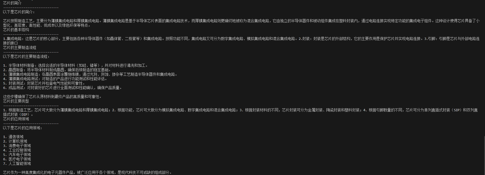

# 本次实验数据集如下所示
## 一、芯片的简介

* 按照制造工艺，芯片可大致分为薄膜集成电路和厚膜集成电路。薄膜集成电路实际上是在半导体芯片表面上的集成电路，而厚膜集成电路严格来说应称为混合集成电路，它主要由独立的半导体设备和被动组件，集成在塑料封装内，并按照一定的电路连接方式进行封装，以实现特定功能的一体化电子组件。通过这种方式，芯片在一定程度上实现了电子元器件的小型化、高密度、高性能、低成本和绿色环保等特性。
## 二、芯片的基本结构

### 芯片的基本结构包括以下几个部分：

* 1.集成电路：这是芯片的核心部分，主要包括各种半导体器件（如晶体管、二极管等）和集成电路。按照功能不同，集成电路又可分为数字集成电路、模拟集成电路和混合集成电路。数字集成电路主要用于实现各种数字逻辑运算和数据处理等功能；模拟集成电路主要用于实现各种模拟量的产生、放大和处理等功能；混合集成电路则主要用于实现数字和模拟两种信号处理功能。
* 2.封装：封装是芯片的外部结构，它的主要作用是保护芯片并实现电路连接。根据封装材料的不同，芯片封装可分为金属封装、陶瓷封装和塑料封装三大类。金属封装具有高导热性和高可靠性等优点，但成本较高；陶瓷封装具有高导热性和高可靠性等优点，但成本也较高；塑料封装具有低成本和易加工等优点，但导热性能较差。
* 3.引脚：引脚是芯片与外部电路连接的接口，它通常由铜、金等金属制成。根据引脚数量的不同，芯片可分为单列直插式封装（SIP）和双列直插式封装（DIP）两种。单列直插式封装的引脚主要呈单排排列，而双列直插式封装的引脚则主要呈双排排列。
## 三、芯片的主要制造流程

### 芯片的制造流程主要包括以下几个步骤：

*  1.半导体材料制备：首先需要选择合适的半导体材料（如硅、锗等），并对材料进行清洗和加工，以备后续制造使用。
*  2.晶圆制备：将半导体材料制备成一定尺寸的晶圆，以便后续制造使用。
*  3.薄膜集成电路制造：在晶圆表面涂覆一层绝缘膜，然后通过光刻、刻蚀、掺杂等工艺手段，制造出半导体器件和集成电路。
*  4.薄膜集成电路测试：对制造出的薄膜集成电路进行功能测试和性能评估，以确保其符合设计要求。
*  5.封装测试：将芯片进行封装并测试其电气性能和可靠性等指标，以确保其符合设计要求和使用要求。
*  6.成品测试：对封装好的芯片进行最终测试和性能评估，以确保其符合产品要求和质量标准。

## 四、芯片的主要类型

### 根据不同的分类标准，芯片可分为以下几种类型：

* 1.根据制造工艺，芯片可大致分为薄膜集成电路和厚膜集成电路两大类。薄膜集成电路实际上是在半导体芯片表面上的集成电路，而厚膜集成电路严格来说应称为混合集成电路，它主要由独立的半导体设备和被动组件，集成在塑料封装内，并按照一定的电路连接方式进行封装，以实现特定功能的一体化电子组件。
* 2.根据功能，芯片可大致分为模拟集成电路、数字集成电路和混合集成电路三大类。模拟集成电路主要用于实现各种模拟量的产生、放大和处理等功能；数字集成电路主要用于实现各种数字逻辑运算和数据处理等功能；混合集成电路则主要用于实现数字和模拟两种信号处理功能。
* 3.根据封装材料的不同，芯片封装可分为金属封装、陶瓷封装和塑料封装三大类。金属封装具有高导热性和高可靠性等优点，但成本较高；陶瓷封装具有高导热性和高可靠性等优点，但成本也较高；塑料封装具有低成本和易加工等优点，但导热性能较差。
* 4.根据引脚数量的不同，芯片可分为单列直插式封装（SIP）和双列直插式封装（DIP）两种。单列直插式封装的引脚主要呈单排排列，而双列直插式封装的引脚则主要呈双排排列。

## 五、芯片的应用领域

### 芯片作为一种高度集成化的电子元器件产品，被广泛应用于各个领域。以下列举几个主要的应用领域：

* 1.通信领域：在通信领域中，无论是移动通信、卫星通信还是光通信等领域，都需要使用大量的芯片来实现信号的发送、接收、处理、传输和交换等功能。例如，手机、基站的射频芯片、处理器、存储器等都是芯片的应用。

* 2.计算机领域：在计算机领域中，芯片是计算机中央处理器、内存、硬盘、显卡等核心部件的主要组成部分。计算机通过芯片实现数据的处理、存储和传输等功能。

* 3.消费电子领域：在消费电子领域中，芯片被广泛应用于各种电子产品中，如电视、音响、录像机、游戏机等。这些电子产品中的芯片负责处理各种信号，实现图像、声音、数据处理等功能。

* 4.工业控制领域：在工业控制领域中，芯片被广泛应用于各种控制系统和仪器仪表中，如PLC、DCS、智能仪表等。这些控制系统和仪器仪表中的芯片负责实现各种控制算法、数据处理和通信等功能。

* 5.汽车电子领域：在汽车电子领域中，芯片被广泛应用于汽车的各种电子控制系统和安全系统中，如发动机控制、刹车控制、安全气囊等。这些系统中的芯片负责实现各种控制算法、信号处理和通信等功能。

* 6.医疗电子领域：在医疗电子领域中，芯片被广泛应用于各种医疗设备和诊断试剂中，如医疗诊断仪器、人工器官等。这些设备和试剂中的芯片负责实现各种信号处理、数据处理和通信等功能。

* 7.人工智能领域：在人工智能领域中，芯片被广泛应用于各种人工智能设备和系统中，如智能机器人、智能家居等。这些设备和系统中的芯片负责实现各种算法加速、数据处理和通信等功能。

### 芯片作为一种高度集成化的电子元器件产品，被广泛应用于各个领域。它已经成为现代科技的重要组成部分，并将继续在未来发挥越来越重要的作用。

