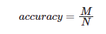

# RAG的流程

  
针对用户输入的一个 query，系统会将其转化为向量并在向量数据库中匹配最相关的文本段，然后根据我们的设定选择 3～5 个文本段落和用户的 query 一起交给大模型，再由大模型根据检索到的文本段落回答用户 query 中提出的问题。在这一整个系统中，我们将向量数据库检索相关文本段落的部分称为检索部分，将大模型根据检索到的文本段落进行答案生成的部分称为生成部分。

因此，检索部分的核心功能是找到存在于知识库中、能够正确回答用户 query 中的提问的文本段落。因此，我们可以定义一个最直观的准确率在评估检索效果：对于 N 个给定 query，我们保证每一个 query 对应的正确答案都存在于知识库中。假设对于每一个 query，系统找到了 K 个文本片段，如果正确答案在 K 个文本片段之一，那么我们认为检索成功；如果正确答案不在 K 个文本片段之一，我们任务检索失败。那么，系统的检索准确率可以被简单地计算为：

    

其中，M 是成功检索的 query 数。

通过上述准确率，我们可以衡量系统的检索能力，对于系统能成功检索到的 query，我们才能进一步优化 Prompt 来提高系统性能。对于系统检索失败的 query，我们就必须改进检索系统来优化检索效果。