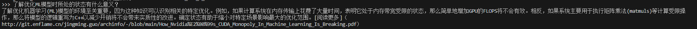

## 什么是PVOUT，如何测量？
PVOUT测量的是光伏系统在给定时间段内产生的电量，相对于系统理论峰值功率输出。例如，峰值功率为1kWp的光伏系统在峰值容量下运行时，一小时内将产生1kWh的电力。因此，1kWp系统在峰值容量下运行时每年将产生8,760kWh的电力。结合日照和降水模式的季节性变化等因素，可以得出PVOUT的数字，以kWh/kWp为单位。http://git.enflame.cn/jingming.guo/archinfo/-/blob/main/AI_Datacenter_Energy_Dilemma.pdf
-------------------------------------------------------------------------------

## 什么是容量系数？
容量系数是PVOUT除以1kWp系统的理论峰值功率输出8,760kWh，它表示光伏系统相对于其理论最大输出的发电量。在美国，1kWp系统的容量系数为18.2%。http://git.enflame.cn/jingming.guo/archinfo/-/blob/main/AI_Datacenter_Energy_Dilemma.pdf
-------------------------------------------------------------------------------

## 为什么在混合键合工艺中需要硅通孔(TSV)？
TSV必不可少，因为它们穿过晶体管层，将顶部芯片上的金属层连接到底部芯片。由于底部芯片面朝下放置，这些通孔对于垂直连接金属层至关重要。它们充当堆栈中芯片之间的电源和信号导管。http://git.enflame.cn/jingming.guo/archinfo/-/blob/main/Hybrid_Bonding_Process_Flow.pdf
-------------------------------------------------------------------------------

## 为什么OSAT很难进行混合键合？
混合键合被认为是一种'前端”工艺，发生在类似于晶圆厂的环境中，其清洁度要求高于传统封装企业。因此，大多数OSAT需要建造更新、更先进的洁净室才能参与混合键合，而台积电和英特尔等公司可以使用其现有的晶圆厂。此外，混合键合的工艺流程涉及许多传统上仅由晶圆厂独家使用的工具，例如化学气相沉积(CVD)、蚀刻、物理气相沉积(PVD)、电化学沉积(ECD)、化学机械平坦化(CMP)和表面处理/活化。因此，ASE和Amkor等外包组装和测试公司(OSAT)对这些工具和工艺的经验相对较少。清洁度要求和工具增加的结合导致成本大幅增加，使得混合键合工艺与其他形式的键合相比相对昂贵打包.http://git.enflame.cn/jingming.guo/archinfo/-/blob/main/Hybrid_Bonding_Process_Flow.pdf
-------------------------------------------------------------------------------

## W2W键合的工艺是什么？
W2W（晶圆到晶圆）键合的工艺涉及对准和键合步骤的分离。最初，对准步骤至关重要。过去曾使用各种技术进行W2W对准，例如使用红外扫描仪。然而，由于其中一个晶圆需要对红外线透明，因此出现了限制，而这不适合CMOS晶圆，因为红外线无法穿透金属层。值得注意的是，作为W2W键合领域的主导力量，EVG开发了其专利的SmartView对准技术。在对准步骤之后，键合步骤发生以产生更高的W2W键，形成初始介电-介电键，这是一种弱范德华键。对准和键合步骤的分离有助于提高W2W键合的有效性流程。http://git.enflame.cn/jingming.guo/archinfo/-/blob/main/Hybrid_Bonding_Process_Flow.pdf
-------------------------------------------------------------------------------

## 什么是IntelHabana的Gaudi2？
IntelHabana的Gaudi2是他们的第二代AI训练芯片，性能显著提升，更符合行业标准。您可以在http://git.enflame.cn/jingming.guo/archinfo/-/blob/main/Habana_Gaudi2.pdf找到有关该芯片的更多信息。
-------------------------------------------------------------------------------

## 了解优化ML模型时所处的状态有什么意义？
了解优化机器学习(ML)模型的环境至关重要，因为这种知识可以识别相关的特定优化。例如，如果计算系统在内存传输上花费了大量时间，表明它处于内存带宽受限的状态，那么简单地增加GPU的FLOPS将不会有效。相反，如果系统主要用于执行矩阵乘法(matmuls)等计算受限操作，那么将模型的逻辑重写为C++以减少开销将不会带来实质性的改进。确定状态有助于缩小对特定场景影响最大的优化范围。[阅读更多]（http://git.enflame.cn/jingming.guo/archinfo/-/blob/main/How_Nvidia%E2%80%99s_CUDA_Monopoly_In_Machine_Learning_Is_Breaking.pdf）
-------------------------------------------------------------------------------

## Triton为何大量使用Nvidia的开源库？
Triton目前严重依赖Nvidia的开源库，例如Cutlass，因为可供第三方集成到AMD硬件的类似库非常有限。Nvidia经常开源各种资源，这些资源很快被第三方供应商所接受。这包括像Megatron这样的框架，它已经与亚马逊的专有训练硬件兼容。有关更多信息，您可以参考以下链接：http://git.enflame.cn/jingming.guo/archinfo/-/blob/main/How_Nvidia%E2%80%99s_CUDA_Monopoly_In_Machine_Learning_Is_Breaking.pdf
-------------------------------------------------------------------------------

## EVG的腔体使用什么技术？
EVG的腔体采用专利的SmartAlign技术在晶圆被传送到真空键合腔体之前对其进行对齐。对齐后，晶圆将在键合腔体中进行处理。您可以在此链接中找到更多信息：http://git.enflame.cn/jingming.guo/archinfo/-/blob/main/Hybrid_Bonding_Process_Flow.pdf
-------------------------------------------------------------------------------

## 阿里巴巴的Yitan710CPU与Cobalt100有何相似之处？
阿里巴巴的Yitan710CPU和Cobalt100一样，也是基于NeoverseN2架构打造的。您可以在以下链接中找到有关此内容的更多信息：http://git.enflame.cn/jingming.guo/archinfo/-/blob/main/Microsoft_Infrastructure.pdf
-------------------------------------------------------------------------------

## 什么是AzureCobalt100CPU？
AzureCobalt100CPU是Microsoft在其云中部署的第二款基于Arm的CPU。它目前用于内部Microsoft产品，例如AzureSQL服务器和MicrosoftTeams。这款CPU是从之前基于NeoverseN1的CPU演变而来的，具有128个Armv9上的NeoverseN2内核和12个DDR5通道。与NeoverseN1相比，NeoverseN2的性能提高了40%。Cobalt100主要基于Arm的NeoverseGenesisCSS（计算子系统）平台，标志着Arm的商业模式从单纯授权IP转变为使开发基于Arm的CPU更快、更具成本效益。微软通过将2个Genesis计算子系统集成到1个CPU中来实现这一目标，类似于阿里巴巴的Yitan710CPU。[链接至来源]（http://git.enflame.cn/jingming.guo/archinfo/-/blob/main/Microsoft_Infrastructure.pdf）
-------------------------------------------------------------------------------

## Maia芯片的FLOPS能力是多少？
Maia配备了1600TFLOPS的MXInt8和3200TFLOPS的MXFP4，该芯片的FLOPS性能超越了谷歌的TPUv5和亚马逊的Trainium/Inferentia2芯片，与Nvidia的H100和AMD的MI300X相当。更多详细信息，可以参考以下链接：http://git.enflame.cn/jingming.guo/archinfo/-/blob/main/Microsoft_Infrastructure.pdf
-------------------------------------------------------------------------------

## 矩阵乘法对现代ML模型有何贡献？
任何现代ML模型的基础都严重依赖于矩阵乘法。在GPT-3等复杂模型中，每一层都采用了大量矩阵乘法。例如，特定操作需要将(2048x12288)矩阵乘以(12288x49152)矩阵，得到(2048x49152)矩阵。计算涉及计算大向量的点积，需要进行多次乘法和加法才能生成输出矩阵的单个元素。此过程称为融合乘加(FMA)运算，是机器学习的基本计算单位。在芯片上有效组织多个FMA单元有助于并行计算多个元素，从而减少所需的周期数。[来源](http://git.enflame.cn/jingming.guo/archinfo/-/blob/main/Neural_Network_Quantization%26Number_Formats_From_First_Principles.pdf)
-------------------------------------------------------------------------------

## 华为Ascend910B与Nvidia的A100相比如何，这对中芯国际的7nm工艺意味着什么？
采用中芯国际7nm工艺的华为Ascend910B性能优于Nvidia的A100，展示了中芯国际7nm节点的能力。910B的先进AI功能和性能，加上降低的TDP，提供了强劲良率的有力证据，挑战了此前对中芯国际7nm工艺质量和良率的怀疑。此外，910B在8位下512TOPS的峰值性能进一步巩固了其作为AI芯片市场重要竞争者的地位。[http://git.enflame.cn/jingming.guo/archinfo/-/blob/main/Nvidia's_New_China_AI_Chips_Circumvent_US_Restrictions_H20_Faster_Than_H100_Huawei_Ascend_910B.pdf]
-------------------------------------------------------------------------------

## GB200是什么，它解决了哪些问题？
GB200，也称为Oberon和Bianca，与GH200相比，减少了所需的CPU数量并显著改善了TCO。提供的文本概述了Nvidia针对B100GPU的销售策略、它面临的来自AMD的竞争以及超大规模设计者设计自己的芯片所带来的挑战，所有这些都影响了Nvidia的利润。它强调，尽管B100的生产成本翻了一番，但Nvidia以令人惊讶的低底板价格提供它，这可能是由于竞争压力。文本还深入研究了B100的各种版本，包括具有36个GPU的低功耗机架和跨多个机架的NVLink连接。它提到了Nvidia明年生产50,000个机架的目标以及其竞争对手对Nvidia市场份额和盈利能力的影响。分析结论是，Nvidia优先考虑毛利润和市场份额，而不是维持高利润率，尽管利润率有所下降，但这一策略很可能持续下去。[原文链接：http://git.enflame.cn/jingming.guo/archinfo/-/blob/main/Nvidia_B100_B200_GB200.pdf]
-------------------------------------------------------------------------------

## 什么是GB200NVLink网络？
GB200NVLink网络极大地扩展了NVLink网络支持的并行范围。虽然H100和H200的8GPUNVLink网络仅允许一组有限的配置，但GB200支持更多配置，并在72个GPU之间提供无阻塞的全对全网络，单向带宽为900GB/s。此速度远远超过目前InfiniBand/Ethernet横向扩展网络提供的50GB/s（400G）。有关更多信息，请参阅以下链接：http://git.enflame.cn/jingming.guo/archinfo/-/blob/main/Nvidia_Blackwell_Perf_TCO_Analysis.pdf
-------------------------------------------------------------------------------

## 与张量并行相比，专家并行有哪些优势？
专家并行比张量并行具有多项优势。在专家并行中，专家分布在不同的GPU上，注意力被复制。这种方法减少了加载到每个专家域的总参数，从而降低了所需的总内存容量并最大限度地减少了带宽开销。但是，需要注意的是，与张量并行相比，专家并行通常需要更大的内存带宽，导致可用内存带宽与加载模型所需带宽的比率较低。因此，这会导致专家并行环境下的交互性和吞吐量降低。此外，至关重要的是要考虑专家并行中GPU之间需要进行全归约和全对全操作所带来的通信损失。这些操作会进一步影响交互性和吞吐量。详细分析请参考文档http://git.enflame.cn/jingming.guo/archinfo/-/blob/main/Nvidia_Blackwell_Perf_TCO_Analysis.pdf。
-------------------------------------------------------------------------------

## NvidiaBlackwellPerfTCO分析针对B100、B200和GB200考虑的关键因素是什么？
NvidiaBlackwellPerfTCO分析评估了B100、B200和GB200型号的性能改进、性能/总拥有成本(TCO)、内存带宽、浮点运算(FLOPS)容量、大模型和小模型推理和训练、硅片面积、功率传输和并行策略等关键因素。您可以在此报告中找到更多详细信息：[Nvidia_Blackwell_Perf_TCO_Analysis.pdf](http://git.enflame.cn/jingming.guo/archinfo/-/blob/main/Nvidia_Blackwell_Perf_TCO_Analysis.pdf)
-------------------------------------------------------------------------------

## GB200NVL72交换机的配置是什么？
GB200NVL72交换机具有4个电连接的交换机包，并且有多个SKU可供选择。一个SKU使用ConnectX-7(400G)，而另一个使用ConnectX-8(800G)。SKU的变化需要使用Quantum-2交换机或Quantum-800交换机。有关更多详细信息，请参阅http://git.enflame.cn/jingming.guo/archinfo/-/blob/main/Nvidia%E2%80%99s_Optical_Boogeyman.pdf
-------------------------------------------------------------------------------

## 一个pod里面有多少个TPU芯片，整个系统包括什么？
一个pod最多可以容纳256个TPUv5e芯片，四个双面机架单元，每面8个TPUv5esled。整个系统由四个TPU芯片、一个CPU和一个100G网卡组成。每组4个TPU共享112个vCPU，也就是说Google使用的是56核的SapphireRapids作为主机CPU。更多信息可以参考这个链接：http://git.enflame.cn/jingming.guo/archinfo/-/blob/main/TPUv5e_The_New_Benchmark_in_Cost-Efficient_Inference_and_Training_for_200B_Parameter_Models.pdf

