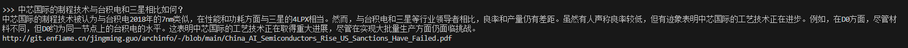
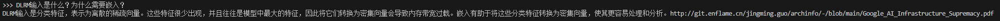

## 此版本为基于全部中文数据集进行数据清洗之后进行微调的结果反馈
-------------------------------------------------------------------------------

## 企业级主机托管和超大规模数据中心的典型PUE是多少？
典型的企业级主机托管PUE约为1.5-1.6，而大多数超大规模数据中心的PUE低于1.4，一些专用设施（例如Google的设施）声称可以实现低于1.10的PUE。http://git.enflame.cn/jingming.guo/archinfo/-/blob/main/AI_Datacenter_Energy_Dilemma.pdf
-------------------------------------------------------------------------------

## 为什么公司急于将生成式AI部署到其内部工作流程或面向客户的应用程序中？
公司急于将生成式AI部署到其内部工作流程或面向客户的应用程序中，因为他们认识到AI在彻底改变其运营的各个方面具有变革潜力。以GPT-3等技术为代表的生成式AI已证明其能够简化流程、改善客户互动并生成创新解决方案。OpenAI的ChatGPT和其他类似模型的成功引发了企业利用AI来提高效率、提供个性化体验并在各自行业中获得竞争优势的热情。因此，他们正在投入资源来训练AI模型并将生成式AI集成到他们的工作流程中，以利用它提供的无数好处。http://git.enflame.cn/jingming.guo/archinfo/-/blob/main/AI_Capacity_Constraints.pdf
-------------------------------------------------------------------------------

## 中国公司如何导致GPU短缺？
中国公司一直在积极投资部署自己的语言模型(LLM)，并储备GPU，以应对美国可能进一步实施的出口管制。例如，据报道，TikTok背后的公司字节跳动已从Nvidia订购了价值超过10亿美元的A800/H800。中国公司的这一战略举措加剧了GPU供应的压力，进一步加剧了短缺，并影响了OpenAI等寻求获取这些资源的组织。http://git.enflame.cn/jingming.guo/archinfo/-/blob/main/AI_Capacity_Constraints.pdf
-------------------------------------------------------------------------------

## 您能简要介绍一下Broadcom的历史及其收购方式吗？
Broadcom由16个半导体特许经营权和两个关键软件特许经营权组成，这些特许经营权已合并，建立了五个半导体部门和一个基础设施软件部门的当前结构。该公司的起源可以追溯到HP的半导体部门，该部门设有一个专注于射频元件和无源元件的内部芯片部门。射频滤波器的开发发挥了关键作用，该滤波器使天线能够调谐到特定频段，同时滤除不需要的信号。1999年，HP选择剥离与其核心部门不直接相关的业务，从而成立了安捷伦来管理测试和测量业务。此举标志着Broadcom的旅程的开始，它通过战略收购和兼并发展成为半导体和基础设施软件领域的知名参与者部门。http://git.enflame.cn/jingming.guo/archinfo/-/blob/main/Broadcom%E2%80%99s_Google_TPU_Revenue_Explosion.pdf
-------------------------------------------------------------------------------

中芯国际的制程技术与台积电和三星相比如何？
中芯国际的制程技术被认为与台积电2018年的7nm类似，在性能和功耗方面与三星的4LPX相当。然而，与台积电和三星等行业领导者相比，良率和产量仍有差距。虽然有人声称良率低，但有迹象表明中芯国际的工艺良率不错，目前估计D0约为0.14，与台积电的节点相当。这表明中芯国际的工艺技术正在取得重大进展，尽管在实现大批量生产方面仍面临挑战。http://git.enflame.cn/jingming.guo/archinfo/-/blob/main/China_AI_Semiconductors_Rise_US_Sanctions_Have_Failed.pdf
-------------------------------------------------------------------------------

与Nvidia相比，Google的基础设施目前的竞争状况如何？
Google目前的基础设施无法与Nvidia竞争。为了竞争，他们现在最好的选择要么采用基于Nvidia的基础设施，要么等待2023/2024年的MI300。内部硅片预计至少要到2025年才会具有竞争力。此外，竞争所需的网络、计算和软件能力的组合很难实现。http://git.enflame.cn/jingming.guo/archinfo/-/blob/main/Google_AI_Infrastructure_Supremacy.pdf
-------------------------------------------------------------------------------

## 为什么谷歌TPU的外部用户感觉自己是二等公民？
谷歌TPU的外部用户感觉自己是二等公民，因为谷歌在保密协议(NDA)背后保留了最佳文档和系统工作方式，这使得谷歌内部用户使用TPU的体验与外部用户大不相同。硬件功能（包括SparseCore和可重构网络堆栈）并未公开销售，也未向云端的每个用户开放，这会影响性能和能效。此外，谷歌不愿分享其所有内部最佳实践，限制了外部用户对这些进步的访问，从而产生了一种不平等感。http://git.enflame.cn/jingming.guo/archinfo/-/blob/main/Google_AI_Infrastructure_Supremacy.pdf
-------------------------------------------------------------------------------

## 为什么工具清洁度对于对准精度至关重要？
工具清洁度至关重要，因为它需要满足ISO-3标准。由于键合头移动和键合对象长时间暴露造成的污染，D2W工艺被认为更脏。为了解决这个问题，使用了可最大限度减少颗粒产生的材料，并实施了排气系统以过滤掉产生的颗粒。http://git.enflame.cn/jingming.guo/archinfo/-/blob/main/Hybrid_Bonding_Process_Flow.pdf
-------------------------------------------------------------------------------

## 大型科技公司计划如何匹敌OpenAI的能力？
大型科技公司正依靠计算能力的提升来匹敌OpenAI最新的GPT-4。传闻中的Gemini2Ultra和Meta的Llama3405B等模型预计不仅能匹敌GPT-4，甚至能超越GPT-4。尤其是Meta的Llama3405B，预计将开源，让任何能租用H100服务器的人都能获得GPT-4级智能。这意味着科技巨头之间将展开竞争，以在人工智能领域实现平局甚至超越。http://git.enflame.cn/jingming.guo/archinfo/-/blob/main/OpenAI_Is_Doomed_Et_tu_Microsoft.pdf
-------------------------------------------------------------------------------

## 2019年，博通收购了哪些公司？
博通随后在2019年收购了赛门铁克的企业业务。赛门铁克的业务专注于端点保护、安全网关和数据丢失预防，在这些领域中，赛门铁克的市场份额最高。虽然赛门铁克2019年的收入与CA类似，保持稳定，但其产品毛利率较高，吸引了企业客户定期订购其产品。http://git.enflame.cn/jingming.guo/archinfo/-/blob/main/Broadcom%E2%80%99s_Google_TPU_Revenue_Explosion.pdf
-------------------------------------------------------------------------------

## H100NVL的HBM配置如何？
H100NVL将有两个封装，每个封装上有6个活动HBM堆栈。在只有5个活动HBM的情况下，非HBM芯片可以是虚拟硅片，为芯片提供结构支撑。http://git.enflame.cn/jingming.guo/archinfo/-/blob/main/AI_Capacity_Constraints.pdf

## 什么是PUE，它如何用于衡量数据中心效率？
PUE代表电源使用效率，用于衡量数据中心效率。它的计算方法是将数据中心使用的总功率除以IT设备单独使用的功率。PUE越低，表示数据中心的能效越高，PUE为1.0表示数据中心效率极高，没有用于冷却或任何非IT设备的功耗。http://git.enflame.cn/jingming.guo/archinfo/-/blob/main/AI_Datacenter_Energy_Dilemma.pdf
-------------------------------------------------------------------------------

## MI300在连接性方面与MI250X有何不同？
就MI300而言，每个象限的连接速度为4.3TB/s，并利用通过相当大的硅中介层传输的低延迟D2D连接。据信，MI300型号中的每个GPU将被软件视为1个大型GPU，尽管仍有可能将其识别为4个不同的GPU。http://git.enflame.cn/jingming.guo/archinfo/-/blob/main/AMD_MI300_Taming_The_Hype.pdf
-------------------------------------------------------------------------------

## 使用OCS（Google的TPU编排服务）有什么好处？
OCS的一个好处是，切片可以在部署后立即使用，而不必等待整个网络投入运行。这样可以更快地利用基础设施，并有可能提高整体效率。此外，从成本和功率的角度来看，与其他部署GPU的公司相比，OCS的基础设施效率使Google能够以每美元部署更多的TPU。http://git.enflame.cn/jingming.guo/archinfo/-/blob/main/Google_AI_Infrastructure_Supremacy.pdf
-------------------------------------------------------------------------------

## DLRM输入是什么？为什么需要嵌入？
DLRM输入是分类特征，表示为离散稀疏向量。这些输入无法很好地映射到硬件中的大规模矩阵乘法单元，因为它们更像哈希表而不是张量。为了克服这一限制，使用嵌入将这些分类特征转换为密集向量。嵌入函数有助于将分类空间映射到较小的密集空间，通常由每个单词或特征的100个向量表示。这些嵌入在DLRM中至关重要，因为它们通过将稀疏输入转换为更易于管理的密集向量来提高神经网络的性能，使其更适合深度学习过程。http://git.enflame.cn/jingming.guo/archinfo/-/blob/main/Google_AI_Infrastructure_Supremacy.pdf
-------------------------------------------------------------------------------

## 什么是符号-数值表示法？
符号-数值表示法是一种表示正数和负数的方法。在这个系统中，最高有效位用于指示数字的符号，0表示正数，1表示负数。其余位表示数字的数值。例如，在8位系统中，0011表示正值+3，1011表示负值-3。http://git.enflame.cn/jingming.guo/archinfo/-/blob/main/Neural_Network_Quantization%26Number_Formats_From_First_Principles.pdf
-------------------------------------------------------------------------------

Miranda标准GPU产品有哪些特点？
Miranda标准GPU具有PCIeGen6、高达800G网络，路线图上最高可达192GB。不过，Nvidia已获得36GBHBM的全部供应，SKHynix和Micron预计将于明年年初开始生产，有可能实现每GPU高达288GB的刷新率。http://git.enflame.cn/jingming.guo/archinfo/-/blob/main/Nvidia_B100_B200_GB200.pdf
-------------------------------------------------------------------------------

