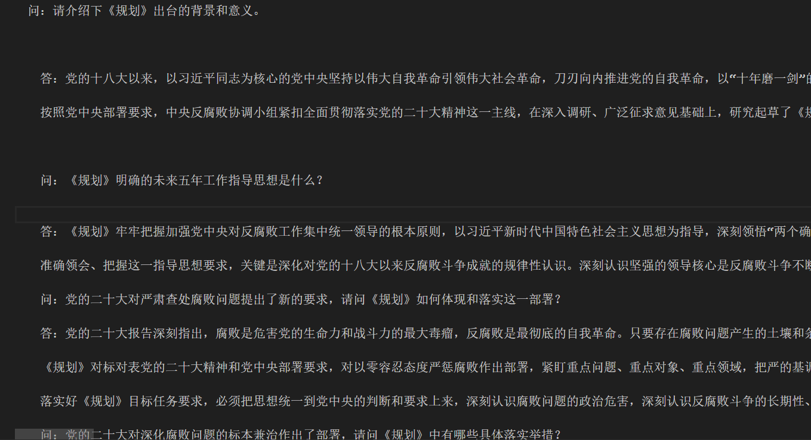
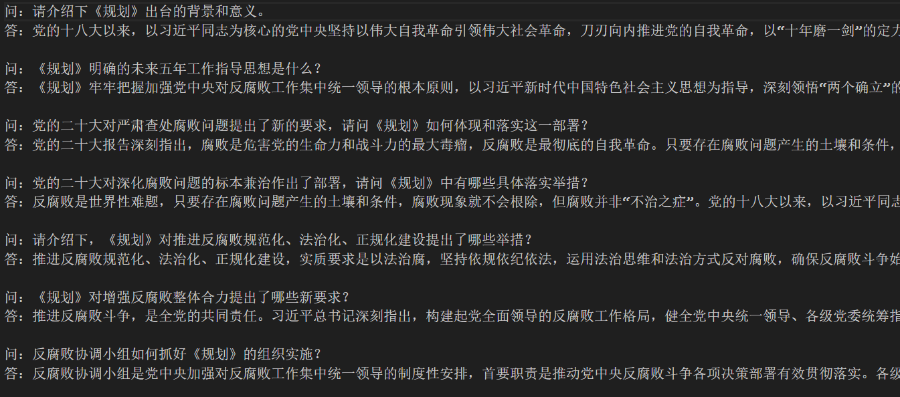
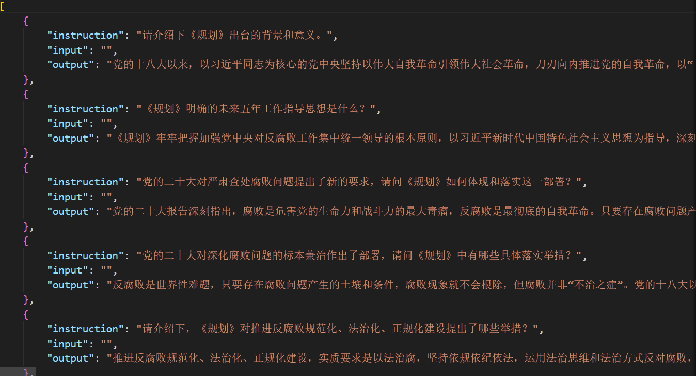

# 以下主要演示一种将杂乱无章的问答形式的数据内容转化为大模型训练所需json格式的转化过程
## 原始内容

    import re

    def format_text(input_file_path, output_file_path):
        with open(input_file_path, 'r', encoding='utf-8') as file:
            content = file.read()

        questions = re.split('问[：:]\s*', content)[1:]

        formatted_text = ''
        for q in questions:
            if re.search('答[：:]\s*', q):
                parts = re.split('答[：:]\s*', q, 1)
                question, answer = parts[0], parts[1]
                formatted_question = '问：' + question.strip()
                # 移除答案文本中的所有换行符
                formatted_answer = '答：' + answer.replace('\n', ' ').strip()
                # 保留数字列表格式，但不引入新的换行符
                formatted_answer = re.sub(r'(\d+)\.', r' \1.', formatted_answer)
                formatted_text += f'{formatted_question}\n{formatted_answer}\n\n'
            else:
                formatted_text += '问：' + q.strip() + '\n\n'

        with open(output_file_path, 'w', encoding='utf-8') as file:
            file.write(formatted_text)

    # 指定源文件路径和输出文件路径
    source_file_path = 'C:\\software\\代码\\test.txt'
    output_file_path = 'text.txt'

    # 调用函数
    format_text(source_file_path, output_file_path)
## 内容的格式化梳理

    import json

    # 定义文件路径
    file_path = 'text.txt'
    output_file_path = 'train.json'

    def convert_file_to_llm_format(file_path):
        llm_data = []
        with open(file_path, 'r', encoding='utf-8') as file:
            lines = file.readlines()
            for i in range(len(lines) - 1):  # 遍历到倒数第二行，避免索引越界
                if lines[i].startswith('问：') and lines[i+1].startswith('答：'):
                    instruction = lines[i].split('问：', 1)[1].strip()
                    output = lines[i+1].split('答：', 1)[1].strip()
                    llm_data.append({
                        "instruction": instruction,
                        "input": "",
                        "output": output
                    })
        return llm_data

    def save_llm_data_to_file(llm_data, output_file_path):
        with open(output_file_path, 'w', encoding='utf-8') as file:
            json.dump(llm_data, file, ensure_ascii=False, indent=4)

    llm_formatted_data = convert_file_to_llm_format(file_path)
    save_llm_data_to_file(llm_formatted_data, output_file_path)

    print(f'数据已成功保存到文件：{output_file_path}')
## 转换为需要的json格式

