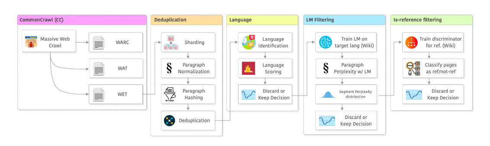
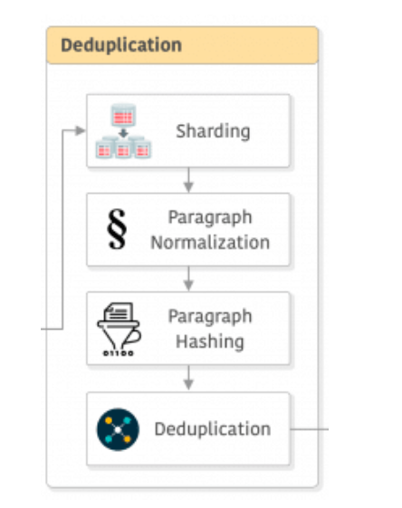
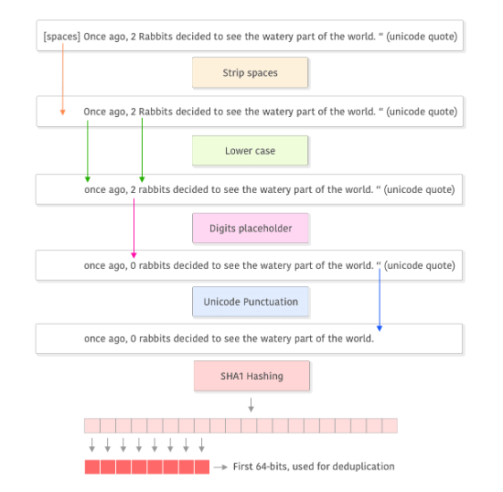
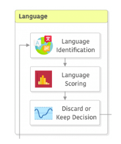
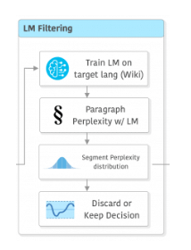
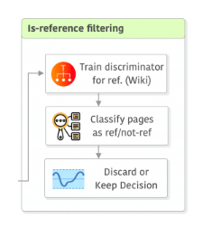
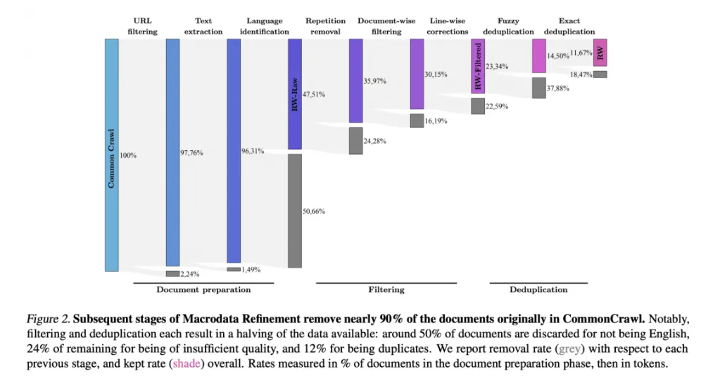

# 如何构建高质量的大语言模型数据集？
## 1.数据粗筛选

### (1) 从数据源（data source）获取数据
#### 这一部分我们的主要从三个方面进行数据获取：
#### a. 其一是筛选拥有能够满足我们需求的垂直领域数据的网站并对其中的内容进行爬取，即关于芯片的行业知识，这部分是让模型对该垂直领域有一个更深的认识
#### b. 其二是从更宽泛的领域的领域进行数据获取，比如我们想要做的芯片领域的大语言模型，那这一部分我们获取的是硬件领域的数据集，这样的数据混合有利于提升模型的泛化能力
#### c. 其三是获取关于我们的芯片，我们内部的数据库知识，这部分相对于第一部分是更精细化的数据内容。
### (2) URL Filtering URL过滤
#### 许多处理流程都使用公开的成人/暴力/恶意软件等网站的屏蔽列表来进行URL过滤。例如，在RefinedWeb中使用了一个包含460万个域名的屏蔽列表，并且还使用了基于单词的URL过滤（a word-based filtering of the URL）。这部分主要是为了过滤无效信息同时提升用户体验。
### (3) 去重（deduplication）

#### 去重包括三部分的去重内容：
#### a. 去除许多模板内容，例如导航菜单、Cookie提醒和联系信息。
#### b. 去除重复的 n-gram 序列（n-gram repetitions）(当文档中某个连续的 n 个单词或字符序列在多个地方重复出现时，就会被视为 n-gram repetitions。)
#### c. 采用MinHash算法进行精确去重，主要目标是去除不同数据源之间同质化的内容，但这里需要考虑一个问题，这两个数据源中的内容可能并不完全相同，如果去重可能会导致模型的泛化程度降低，不去重又可能导致输出的内容较为重复同时在训练过程中对算力的要求也会提升

### (4) 语言识别（language）
#### 这部分主要是针对模型所需要面对的语言环境进行数据过滤，利用fastText来精细化需要的语言环境

### (5) 使用模型筛选（filtering）

#### 为了进一步提高数据的质量，我们还需要利用模型增加一些对数据的评判，这里采用了困惑度作为评判标准。这里利用困惑度和n-gram作为一个基准判断每个段落。有了困惑度的值后，还需要确定阈值。CCNet论文中描述了他们如何从每种语言的困惑度分布（the distribution of perplexities）中计算出三个等分的部分（头部、中间部分和尾部），因为不同语言的困惑度分布差异很大。（困惑度是指语言模型对段落的理解和连贯性的评估。通过计算不同段落的困惑度，可以得到一个困惑度值的集合，然后分析这个集合的分布情况，以确定阈值或者其他统计特征，用于判断段落的质量或可靠性。）这部分还需要根据行业具体设定规则，因为泛泛的规则很可能会将一些重要的行业术语，专业术语被当作无效数据处理掉。
### (6)LLaMA中添加的“是否是参考来源”筛选（“is-reference” filtering） 。

#### 尽管CCNet的论文中对这一步骤的描述并不详细，但似乎是通过训练一个简单的线性分类器（不确定使用哪些特征）来对维基百科中引用作参考的页面和随机抽样的页面进行分类，然后将被分类为“未被引用参考”的页面舍弃。这部分主要考虑到被引用参考的内容往往可靠性是更高的，这就在一定程度上提高了数据的质量。

### 以下为整个处理流程下来数据量的变化：
