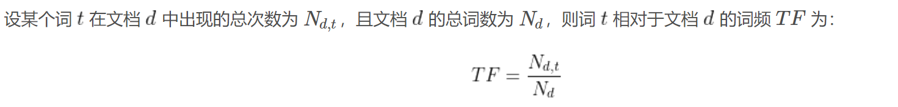
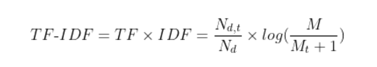
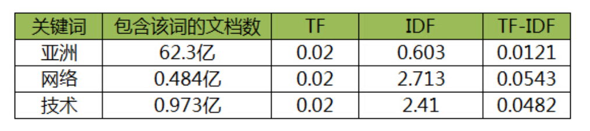

# TF-IDF(TermFrequency-InverseDocumentFrequency)词频-逆文档频率
## 本文主要对BERTScore在计算P,R中所使用的TF-IDF方法加以说明,想要对此有更详细的了解可参考同一目录下的同名论文
这是一种针对关键词的统计分析方法，涉及数据挖掘、文本处理、信息检索等多个领域。其中，TF表示词频(TermFrequency)，IDF表示逆文档频率(InverseDocumentFrequency)。

TF-IDF的作用：评估某个词(Term)对一个文档集/语料库(包含了若干文档)中的某篇文章/文档(Document)的重要程度。

TF-IDF的核心思想：一个词的重要程度，与其在某篇文档中出现的次数成正比，与带有该词的文档总数成反比。换言之，一个词在某篇文档中出现的次数越多(频率越高)，但在所有其他文档中出现的频率越低(次数越少)，则该词与该文档的相关性越强、越能代表/刻画该文档的主题、越能使文档具有区分度。
# TF
TF-IDF中的TF表示词频(TermFrequency)，即某个词在某篇文档中出现的总次数(频数)。通常，需要对其进行归一化统一量纲(词频=词频数/文档总词数)，以避免词频因文档长度不同而产生偏差(词频因长文档具有的词数多就相对高、因短文档具有的词数少就相对低，将导致无法真正衡量词的重要性)。

# IDF
IDF表示逆文档频率(InverseDocumentFrequency)，被用作IF的权重，其大小与一个词的常见程度成反比。

一些高频出现的常见词对与刻画主题可能并无太大贡献(如“的”、“了”等停顿词(Stopwords)没有实际意义但IF却很高)，反倒是一些低频出现的特定词可能才能表达文档的主题(如一些区别度高的专有名词、人物地点IF却很低)，故仅单纯使用TF并不恰当。

为此，衡量一个词的重要性，应满足：一个词预测/刻画/代表主题的能力越强，则其权重越大；反之，权重越小。例如，在文档集/语料库中，若某些词只在很少的几篇文档中出现过，那么这样的词将被认为对刻画文档主题的作用很大，从而这些词应具有更大的权重。IDF正是在完成这样的工作。

# TF-IDF
 
以使用TF-IDF提取关键词为例，设某文包含1000个词。其中，“亚洲”、“网络”、“技术”在该文中均出现20次，则三者对该文均有TF=0.02。然后，假设根据网页搜索统计得知，包含“的”字的网页数共250亿，并将其设为中文网页总数；同时，包含“亚洲”、“网络”、“技术”的中文网页数分别为62.3亿、0.484亿、0.973亿。那么，根据公式，三者的IDF及TF-IDF分别如下所示：

# TF-IDF的优点
* 容易理解，概念简单
* 实现便捷、快速
* 有一定实际效果，性价比高
# TF-IDF的缺点
* 用TF衡量词的重要性不够合理，例如，有时对主题刻画具有代表性的词，其在某篇文档的出现次数不多将导致TF低，但其重要性实际并不低(如具有代表性但出现次数不多的专业名词、人物地点等，但可能通篇都围绕其阐述和解释)；反之，许多如没有实际意义的语气词、助词(停顿词)却因出现次数多导致IF高
* 用IDF衡量词的重要性不够合理，例如，有时对主题刻画不具有代表性的词，其在所有文档的出现频率较低将导致IDF高，但其重要性实际并不高；反之，某些因重要性高而被大量文档提及的词，却因出现频率高导致IDF低
* 忽略了词在同一类别中、不同类别间的分布情况，仅考虑了词与其出现的文档之间的关系，过于单纯简单
* 并未考虑词的语义信息，无法处理一词多义/一义多词等各种语义相关的复杂情况
* 无法体现词的位置信息，出现靠前和靠后的词很可能具有不同的重要性/区分度，不应等同视之

