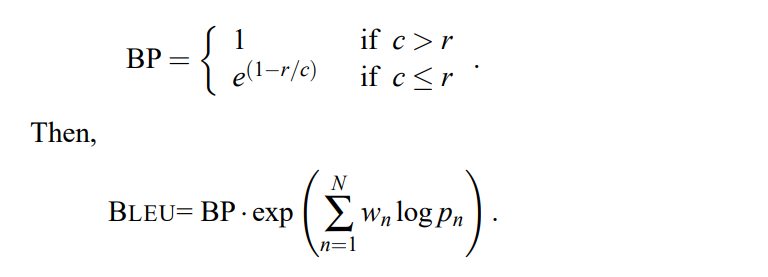
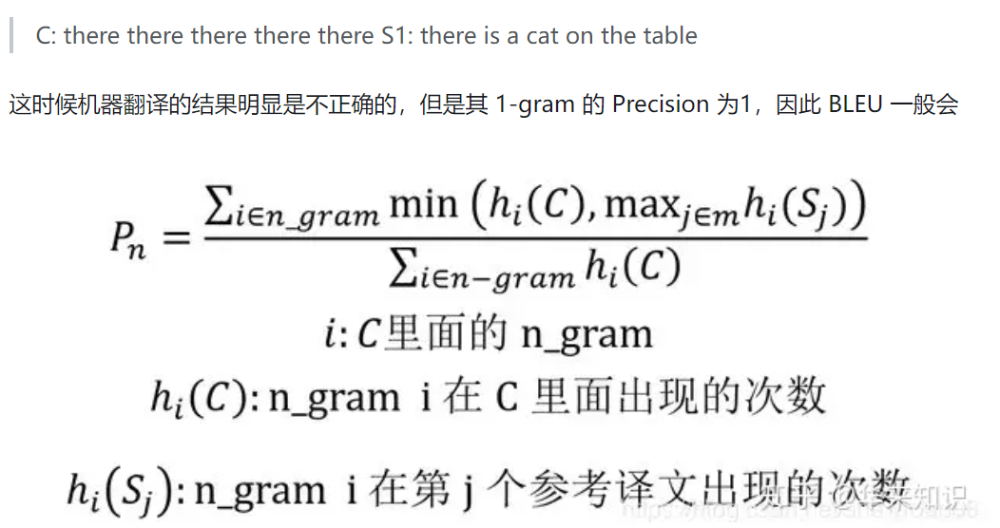
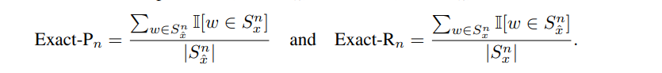
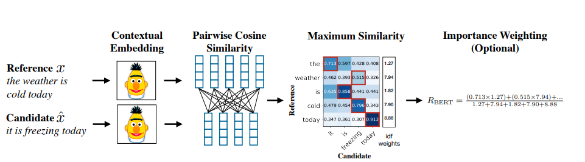

# 基于词重叠率的方法
## BLEU（Bilingual Evaluation Understudy，双语评估辅助工具）
### 核心思想是比较候选译文和参考译文里的 n-gram 的重合程度，重合程度越高就认为译文质量越高。unigram用于衡量单词翻译的准确性，高阶n-gram用于衡量句子翻译的流畅性。实践中，通常是取N=1~4，然后对进行加权平均。

* BLEU 需要计算译文 1-gram，2-gram，...，N-gram 的精确率，一般 N 设置为 4 即可，公式中的 Pn 指 n-gram 的精确率。
* Wn 指 n-gram 的权重，一般设为均匀权重，即对于任意 n 都有 Wn = 1/N。
* BP 是惩罚因子，如果译文的长度小于最短的参考译文，则 BP 小于 1。
* BLEU 的 1-gram 精确率表示译文忠于原文的程度，而其他 n-gram 表示翻译的流畅程度。 
#### 不过BLEU对词重复有着非常不好的表现，所以改进的BLEU使用改进的多元精度（n-gram precision） 对其进行了优化。
### 改进的多元精度（n-gram precision）

* 针对上面的例子 p1 = 1/5 (因为there在C和S1中都出现了 我们按最少的次数来)
### 优点
* 它的易于计算且速度快，特别是与人工翻译模型的输出对比；
* 它应用范围广泛，这可以让你很轻松将模型与相同任务的基准作对比。
### 缺点
* 它不考虑语义，句子结构；
* 不能很好地处理形态丰富的语句；
* BLEU 指标偏向于较短的翻译结果（brevity penalty没有想象中那么强）。
   

# 基于距离的方法
## TER(Translation Edit Rate)
### TER是一种基于距离的评价方法，用来评定机器翻译结果的译后编辑的工作量。

* 这里，距离被定义为将一个序列转换成另一个序列所需要的最少编辑操作次数。操作次数越多，距离越大，序列之间的相似性越低；相反距离越小，表示一个句子越容易改写成另一个句子，序列之间的相似性越高。

* TER 使用的编辑操作包括：增加、删除、替换和移位。其中增加、删除、替换操作计算得到的距离被称为编辑距离，并根据错误率的形式给出评分
  
**score = edit(c,r)/l**
 

其中 edit(c,r) 是指机器翻译生成的候选译文 c 和参考译文 r 之间的距离，l 是归一化因子，通常为参考译文的长度。在距离计算中所有的操作的代价都为 1。在计算距离时，优先考虑移位操作，再计算编辑距离，也就是增加、删除和替换操作的次数。直到移位操作无法减少编辑距离时，将编辑距离和移位操作的次数累加得到TER计算的距离。
* Candidate：cat is standing in the ground 
* Reference：The cat is standing on the ground

将 Candidate 转换为 Reference，需要进行一次增加操作，在句首增加 “The”；一次替换操作，将 “in” 替换为 “on”。所以 edit(c, r) = 2，归一化因子 l 为 Reference 的长度 7，所以该参考译文的 TER 错误率为 2/7。
   

# 基于bert的评分指标
## BERTScore
### 即对两个生成句和参考句（word piece进行tokenize）分别用bert提取特征，然后对2个句子的每一个词分别计算内积，可以得到一个相似性矩阵。基于这个矩阵，我们可以分别对参考句和生成句做一个最大相似性得分的累加然后归一化，得到BERTScore的Precision，Recall和F1：

### 流程如下图所示：

