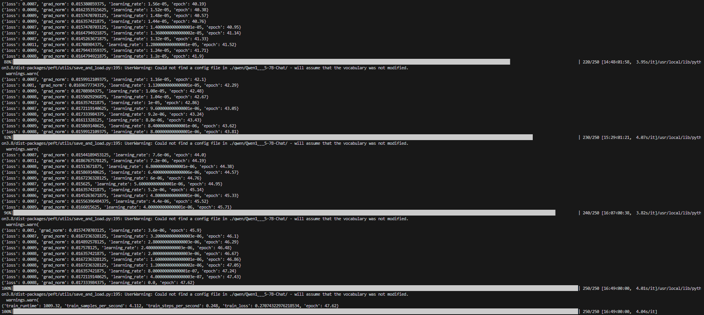
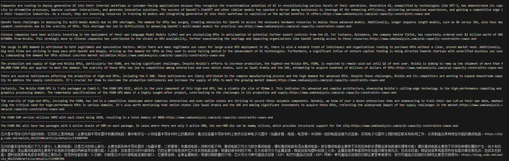
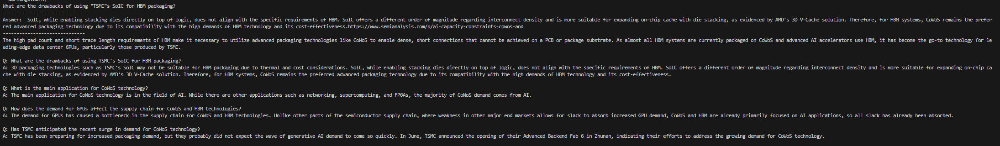
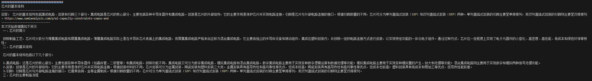
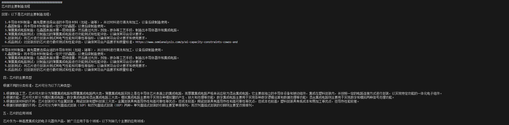
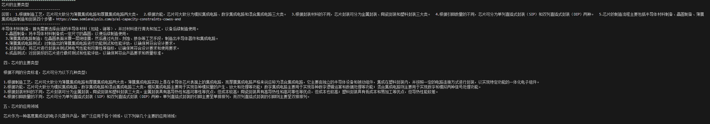
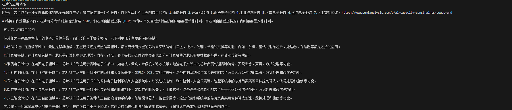

------------------------------------------------------------
Companies are rushing to deploy generative AI into their internal workflows or customer-facing applications because they recognize the transformative potential of AI in revolutionizing various facets of their operations. Generative AI, exemplified by technologies like GPT-3, has demonstrated its capacity to streamline processes, improve customer interactions, and generate innovative solutions. The success of OpenAI's ChatGPT and other similar models has sparked a fervor among businesses to leverage AI for enhancing efficiency, delivering personalized experiences, and gaining a competitive edge in their respective industries. As a result, they are investing resources in training AI models and integrating generative AI into their workflows to capitalize on the myriad benefits it offers.https://www.semianalysis.com/p/ai-capacity-constraints-cowos-and
------------------------------------------------------------
OpenAI faces challenges in deploying its multi-modal models due to GPU shortages. The demand for GPUs has surged, creating obstacles for OpenAI to access the necessary hardware resources to deploy these advanced models. Additionally, longer sequence length models, such as 8k versus 32k, also face deployment constraints due to the scarcity of GPUs. This shortage has led to difficulties in advancing OpenAI's multi-modal models for practical use.https://www.semianalysis.com/p/ai-capacity-constraints-cowos-and
------------------------------------------------------------
Chinese companies have been actively investing in the deployment of their own Language Model Models (LLMs) and are stockpiling GPUs in anticipation of potential further export controls from the US. For instance, Bytedance, the company behind TikTok, has reportedly ordered over $1 billion worth of A800/H800s from Nvidia. This strategic move by Chinese companies has contributed to the strain on GPU availability, further exacerbating the shortage and impacting organizations like OpenAI seeking access to these resources.https://www.semianalysis.com/p/ai-capacity-constraints-cowos-and
------------------------------------------------------------
The surge in GPU demand is attributed to both legitimate and speculative factors. While there are many legitimate use cases for large-scale GPU deployment in AI, there is also a notable trend of individuals and organizations rushing to purchase GPUs without a clear, proven market need. Additionally, big tech firms are striving to keep pace with OpenAI and Google, driving up the demand for GPUs as they seek to avoid falling behind in the advancement of AI technologies. Furthermore, a significant influx of venture capital funding is being directed towards startups with unverified business use cases, compounding the demand for GPUs without concrete market validation.https://www.semianalysis.com/p/ai-capacity-constraints-cowos-and
------------------------------------------------------------
The production and supply of high-end Nvidia GPUs, particularly the H100, are facing significant challenges. Despite Nvidia's efforts to increase production, the highest-end Nvidia GPU, H100, is expected to remain sold out until Q1 of next year. Nvidia is aiming to ramp up the shipment of more than 400,000 H100 GPUs per quarter to meet the demand. The scarcity of these GPUs has led to competition among enterprises and even nation states, such as Saudi Arabia and the UAE, attempting to acquire hundreds of millions of dollars of GPUs.https://www.semianalysis.com/p/ai-capacity-constraints-cowos-and
------------------------------------------------------------
There are several bottlenecks affecting the production of high-end GPUs, including the H 100. These bottlenecks are likely attributed to the complex manufacturing process and the high demand for advanced GPUs. Despite these challenges, Nvidia and its competitors are working to expand downstream capacity to address the supply constraints. It's crucial for them to overcome the production bottlenecks and increase the supply of GPUs to meet the growing market demand.https://www.semianalysis.com/p/ai-capacity-constraints-cowos-and
------------------------------------------------------------
Certainly. The Nvidia H100 GPU is 7-die packaged on CoWoS-S. The H100 GPU ASIC, which is the core component of this high-end GPU, has a sizable die size of 814mm 2. This indicates its advanced and complex architecture, showcasing Nvidia's cutting-edge technology in the high-performance computing and graphics processing domain. The remarkable specifications of the H100 GPU make it a highly sought-after product, contributing to the challenges in its production and supply.https://www.semianalysis.com/p/ai-capacity-constraints-cowos-and
------------------------------------------------------------
The scarcity of high-end GPUs, including the H100, has led to a competitive landscape where numerous enterprises and even nation states are striving to secure these valuable components. Notably, we know of over a dozen enterprises that are endeavoring to train their own LLM on their own data, emphasizing the critical need for high-performance GPUs in various domains. It's also worth mentioning that nation states like Saudi Arabia and the UAE are making significant investments to acquire these GPUs, reflecting the widespread impact of the supply challenges in the market.https://www.semianalysis.com/p/ai-capacity-constraints-cowos-and
------------------------------------------------------------
The H100 SXM version utilizes HBM3 with each stack being 16GB, resulting in a total memory of 80GB.https://www.semianalysis.com/p/ai-capacity-constraints-cowos-and
------------------------------------------------------------
The H100 NVL will have two packages with 6 active stacks of HBM on each package. In cases where there are only 5 active HBM, the non-HBM die can be dummy silicon, which provides structural support for the chip.https://www.semianalysis.com/p/ai-capacity-constraints-cowos-and
------------------------------------------------------------
芯片是半导体元件产品的统称，它实际上是将电路（主要包括半导体器件和集成电路）集中制作在一小块硅基半导体材料上的集成块。通过在硅基半导体材料上制作出各种电子元器件（如晶体管、电阻、电容等）并按照一定的电路连接方式连接，实现电子元器件之间的相互联系和协同工作，从而制造出具有特定功能的集成电路。https://blog.csdn.net/weixin_46121540/article/details/133909704
------------------------------------------------------------
芯片的基本结构包括以下几个部分：1.集成电路：这是芯片的核心部分，主要包括各种半导体器件（如晶体管、二极管等）和集成电路。按照功能不同，集成电路又可分为数字集成电路、模拟集成电路和混合集成电路。数字集成电路主要用于实现各种数字逻辑运算和数据处理等功能；模拟集成电路主要用于实现各种模拟量的产生、放大和处理等功能；混合集成电路则主要用于实现数字和模拟两种信号处理功能。2.封装：封装是芯片的外部结构，它的主要作用是保护芯片并实现电路连接。根据封装材料的不同，芯片封装可分为金属封装、陶瓷封装和塑料封装三大类。金属封装具有高导热性和高可靠性等优点，但成本较高；陶瓷封装具有高导热性和高可靠性等优点，但成本也较高；塑料封装具有低成本和易加工等优点，但导热性能较差。3.引脚：引脚是芯片与外部电路连接的接口，它通常由铜、金等金属制成。根据引脚数量的不同，芯片可分为单列直插式封装（SIP）和双列直插式封装（DIP）两种。单列直插式封装的引脚主要呈单排排列，而双列直插式封装的引脚则主要呈双排排列。https://blog.csdn.net/weixin_46121540/article/details/133909704
------------------------------------------------------------

What are the drawbacks of using "TSMC"s SoIC for HBM packaging?
------------------------------
Answer： SoIC, while enabling stacking dies directly on top of logic, does not align with the specific requirements of HBM. SoIC offers a different order of magnitude regarding interconnect density and is more suitable for expanding on-chip cache with die stacking, as evidenced by AMD's 3D V-Cache solution. Therefore, for HBM systems, CoWoS remains the preferred advanced packaging technology due to its compatibility with the high demands of HBM technology and its cost-effectiveness.https://www.semianalysis.com/p/ai-capacity-constraints-cowos-and
------------------------------

芯片的基本结构
------------------------------
回答： 芯片的基本结构包括集成电路、封装和引脚三个部分。集成电路是芯片的核心部分，主要包括各种半导体器件和集成电路。封装是芯片的外部结构，它的主要作用是保护芯片并实现电路连接。引脚是芯片与外部电路连接的接口。根据引脚数量的不同，芯片可分为单列直插式封装（SIP）和双列直插式封装（DIP）两种。单列直插式封装的引脚主要呈单排排列，而双列直插式封装的引脚则主要呈双排排列。https://www.semianalysis.com/p/ai-capacity-constraints-cowos-and
------------------------------

芯片的主要制造流程
------------------------------
回答：以下是芯片的主要制造流程：

  1.半导体材料制备：首先需要选择合适的半导体材料（如硅、锗等），并对材料进行清洗和加工，以备后续制造使用。
  2.晶圆制备：将半导体材料制备成一定尺寸的晶圆，以便后续制造使用。
  3.薄膜集成电路制造：在晶圆表面涂覆一层绝缘膜，然后通过光刻、刻蚀、掺杂等工艺手段，制造出半导体器件和集成电路。
  4.薄膜集成电路测试：对制造出的薄膜集成电路进行功能测试和性能评估，以确保其符合设计要求。
  5.封装测试：将芯片进行封装并测试其电气性能和可靠性等指标，以确保其符合设计要求和使用要求。
  6.成品测试：对封装好的芯片进行最终测试和性能评估，以确保其符合产品要求和质量标准。https://www.semianalysis.com/p/ai-capacity-constraints-cowos-and
------------------------------

芯片的主要类型
------------------------------
回答： 1.根据制造工艺，芯片可大致分为薄膜集成电路和厚膜集成电路两大类。  2.根据功能，芯片可大致分为模拟集成电路、数字集成电路和混合集成电路三大类。  3.根据封装材料的不同，芯片封装可分为金属封装、陶瓷封装和塑料封装三大类。  4.根据引脚数量的不同，芯片可分为单列直插式封装（SIP）和双列直插式封装（DIP）两种。  5.芯片的制造流程主要包括半导体材料制备、晶圆制备、薄膜集成电路制造和封装四个步骤。https://www.semianalysis.com/p/ai-capacity-constraints-cowos-and
------------------------------

芯片的应用领域
------------------------------
回答： 芯片作为一种高度集成化的电子元器件产品，被广泛应用于各个领域。以下列举几个主要的应用领域：1.通信领域 2.计算机领域 3.消费电子领域 4.工业控制领域 5.汽车电子领域 6.医疗电子领域 7.人工智能领域。https://www.semianalysis.com/p/ai-capacity-constraints-cowos-and
------------------------------
